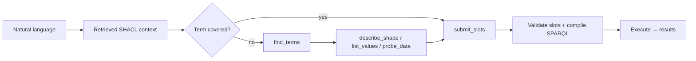

# Agent Tools

The LLM agent authors a **structured search** — never raw SPARQL — by calling a small,
well-defined set of tools. They fall into two groups:

- **One submission tool** (`submit_slots`) — the _only_ path that produces a query. The LLM
  fills `SearchSlots` (domains, filters, ranges, cross-domain references) and a deterministic
  compiler turns them into SPARQL. This is the security boundary: no prompt injection can
  make the model emit an arbitrary query, because the model never writes query text.
- **Four read-only lookup tools** — optional, bounded by `LLM_MAX_AGENT_STEPS`, used when the
  retrieved SHACL context doesn't already cover a user term. Every argument is validated
  against the term index, and every query they run is either a schema-index lookup or SPARQL
  emitted by the deterministic compiler — the model never supplies query text, patterns, or
  IRIs it hasn't first read from the index.

Each tool is defined **once** (name, description, Zod argument schema, handler) and wrapped
for both SDKs — the Vercel AI SDK (`tool()`) and the GitHub Copilot SDK (`defineTool` +
`z.toJSONSchema(..., { target: 'draft-2020-12' })`). A shared `AgentPolicy` decides _which_
tools are exposed; the adapters only translate transport. See **[Agent Design](/agent)** for
the adapter pattern and the post-LLM validation pipeline.

## The tools

### Submission tool

| Tool                                        | Purpose                                                                                                                                                                                        |
| ------------------------------------------- | ---------------------------------------------------------------------------------------------------------------------------------------------------------------------------------------------- |
| `submit_slots(slots, interpretation, gaps)` | The **only submission path**. Fill `slots` for understood concepts, report `gaps` for terms that map to nothing. Call exactly once. The compiler builds SPARQL from `slots` deterministically. |

`submit_slots` arguments:

```typescript
submit_slots({
  slots: {
    domains:  string[],                                     // asset types to search
    filters:  Record<string, string | string[]>,           // enum/literal filters keyed by the
                                                            //   SHACL leaf local name (country,
                                                            //   license, …); array = IN-semantics
    ranges:   Record<string, { min?: number; max?: number }>, // numeric ranges by local name
    references?: Reference | Reference[],                   // cross-domain JOIN(s), AND-combined;
                                                            //   each may nest its own `references`
  },
  interpretation: { summary: string; mappedTerms: MappedTerm[] },
  gaps: { term: string; reason: string; suggestions?: string[] }[],
})

type Reference   = { domain: string; label?: string; filters?; ranges?; references?: Reference[] }
type MappedTerm  = { input: string; mapped: string; confidence: 'high'|'medium'|'low'; property?: string }
```

### Lookup tools (read-only)

| Tool                           | Purpose                                                                                                                                                                                                                             |
| ------------------------------ | ----------------------------------------------------------------------------------------------------------------------------------------------------------------------------------------------------------------------------------- |
| `find_terms(text)`             | Look up ontology terms matching a free-text concept. Returns the best-matching properties/classes with domain, labels, datatype, allowed values, and reference edges. Use when a user term matches nothing in the provided context. |
| `describe_shape(iri)`          | Return the minimal SHACL fragment (constraints, datatypes, enumerations) for one property/class IRI previously returned by `find_terms`.                                                                                            |
| `list_values(propertyIri)`     | List a property's **declared** (`sh:in`) values and its **live observed** values. An allowed value with no observations is a data gap worth reporting.                                                                              |
| `probe_data(domain, filters?)` | Count live instances of a domain, optionally filtered by exact property values. Distinguishes "the ontology can't express this" from "no data matches" before submitting. Bounded and read-only.                                    |

## Workflow



The model reads the schema, optionally confirms a term or a data gap with a bounded lookup,
then commits its answer with a single `submit_slots` call. Compilation and execution are
deterministic and never see model-authored query text.

## Design principles

- **Graph-driven** — properties, classes, enums and ranges are discovered from SHACL at
  runtime (via the term index and property-path discovery), never hardcoded. Drop in another
  OWL + SHACL ontology and the same tools work unchanged.
- **The model never writes SPARQL** — it fills structured slots; a deterministic compiler is
  the single query author. Same slots always compile to the same query.
- **Read-only, index-validated lookups** — lookup arguments are checked against the term
  index; their queries are index lookups or compiler-emitted SPARQL. `submit_slots` remains
  the only submission path.
- **Defined once, wrapped per SDK** — a single SDK-agnostic `SchemaToolDefinition`
  (`schema-tools.ts`) is adapted for the Vercel and Copilot SDKs, so the two adapters cannot
  drift. A contract test (`agent-policy-contract.test.ts`) pins that both register exactly
  `[...lookupTools, submit_slots]`.
- **Standards-based** — the slot intermediate representation is a JSON Schema 2020-12
  tool-call contract (`[JSON-SCHEMA-CORE]`); see **[Standards Compliance](/standards-audit)**.

## Relationship to an agentic authoring loop

This surface is deliberately **narrower** than a general "explore → describe → assemble →
validate → save" authoring agent. Slot-filling is a bounded extraction task, so exposing one
submission tool plus a few read-only lookups keeps the loop to (usually) a **single**
LLM round-trip — cheaper, faster, and injection-safe — while the read-only lookups still give
the model an escape hatch to resolve unfamiliar terms against the live schema and data.
