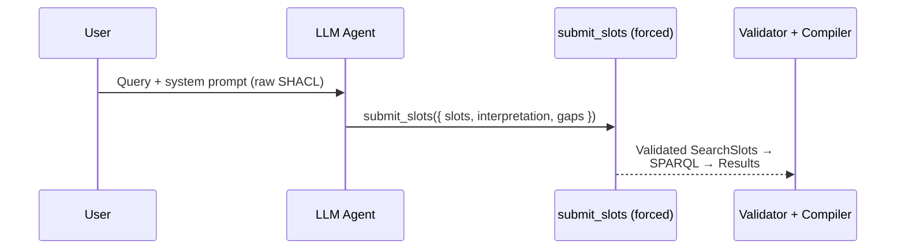
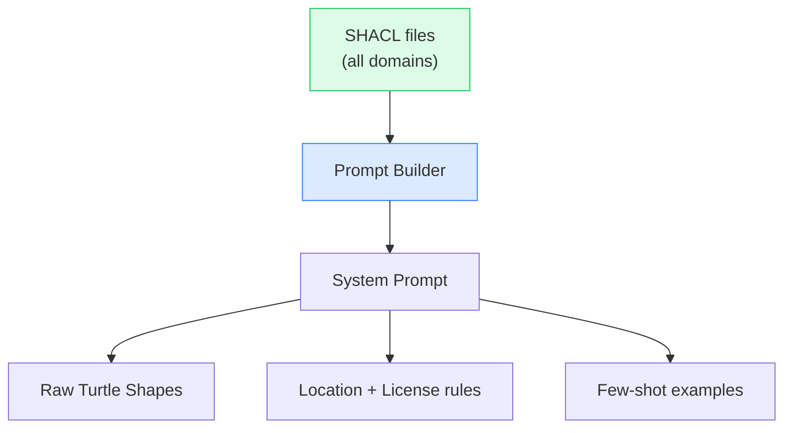
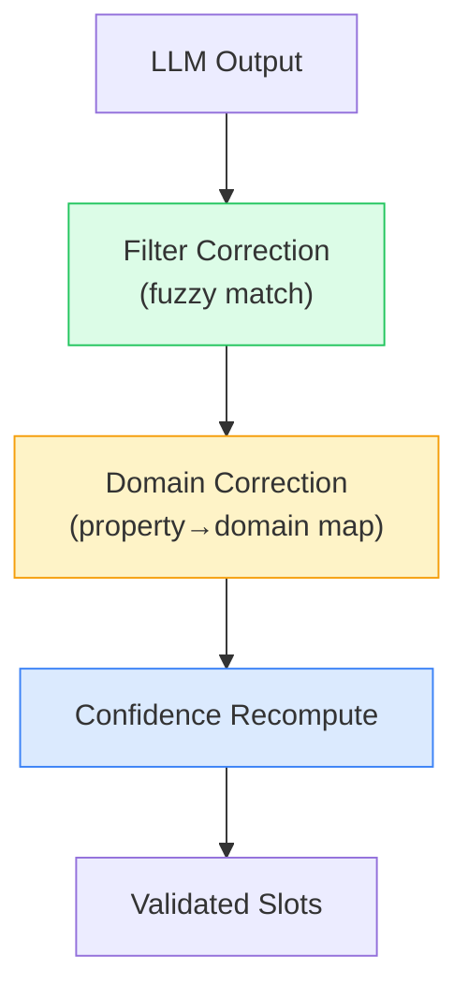

# Agent Design

Single-tool agent with forced structured output. The LLM never writes SPARQL — it fills structured slots via exactly one tool call.

## Tool Architecture

The agent exposes a **single tool** (`submit_slots`) with forced tool choice. The LLM receives the full SHACL vocabulary in its system prompt and directly fills search slots in one round-trip.



### submit_slots Schema

```typescript
submit_slots({
  slots: {
    domains: string[],                                       // Asset types to search
    filters: Record<string, string | string[]>,              // Enum filters (any sh:in property,
                                                              //   including country / region /
                                                              //   license — all keyed by SHACL
                                                              //   leaf local name, no special-case
                                                              //   `location` or `license` slots)
    ranges: Record<string, { min?: number; max?: number }>,  // Numeric ranges
    references?: Reference | Reference[]                     // Cross-domain JOIN(s) to other
                                                              //   asset classes (SHACL-discovered).
                                                              //   An array is AND-combined; each
                                                              //   Reference may nest its own
                                                              //   `references` to express a chain.
  },
  interpretation: string,                                    // Human-readable summary
  gaps: [{ term, reason, suggestions? }]                     // Unresolvable terms; suggestions
                                                              //   come from tokenised match
                                                              //   against the real vocabulary
})

// A cross-domain reference, recursive so it can express a chain.
type Reference = { domain: string; label?: string; references?: Reference[] }
```

Slot shape: there are no top-level `location` or `license` objects — both flow through `filters` keyed by the SHACL leaf local name (e.g. `country`, `region`, `license`). The `references` slot is a **list** of cross-domain JOINs whose targets are SHACL-discovered asset classes; entries are **AND-combined** (the asset must reference all of them). Each entry may **nest** its own `references` to express a chain — "scenarios derived from traces with maps" → `[{ domain: 'ositrace', references: [{ domain: 'hdmap' }] }]` (scenario → trace → map), as opposed to flat siblings `[{ ositrace }, { hdmap }]` (scenario → trace AND scenario → map). A single object is still accepted and normalized to a one-element list.

### Forced tool choice

The agent runs with `toolChoice: { type: 'tool', toolName: 'submit_slots' }` (Vercel AI SDK) or `availableTools: ['submit_slots']` (Copilot SDK) — the LLM has no alternative and commits to structured output on step 1. Both adapters read this constraint from the shared `AgentPolicy` module, ensuring they can never diverge.

## Architecture: SDK Adapter Pattern

Both adapters share a single policy and context layer:

```
┌─────────────────────────────────┐
│  agent-policy.ts                │  ← Single source of truth
│  (forcedTool, temperature,      │     (tool choice, reasoning, steps)
│   thinking, reasoningEffort,    │
│   maxSteps, model)              │
├─────────────────────────────────┤
│  agent-context.ts               │  ← Shared caching
│  (system prompt, vocabulary,    │     (deduplicated across adapters)
│   SparqlStore)                  │
├────────────────┬────────────────┤
│ Vercel Adapter │ Copilot Adapter│  ← SDK-specific transport only
│ (index.ts)     │ (copilot-      │
│                │  agent.ts)     │
├────────────────┴────────────────┤
│  run-slot-pipeline.ts           │  ← Shared post-LLM pipeline
│  (validation + SPARQL compile)  │
└─────────────────────────────────┘
```

A contract test (`agent-policy-contract.test.ts`) pins that both adapters:

- Register only `submit_slots` (no investigation tools)
- Use the policy's temperature, model, and forced tool choice
- Cannot import the deleted `investigation-tools` module

## Context Engineering

The system prompt is **auto-generated from raw SHACL shapes** at startup. The LLM reads native Turtle directly:



### Why raw SHACL in the prompt

The LLM natively understands SHACL constraint vocabulary:

- **`sh:in (...)`** — allowed values → synonym resolution
- **`sh:pattern`** — format constraints (ISO codes, etc.)
- **`sh:datatype xsd:integer`** → range queries
- **`sh:description`** — semantic context for disambiguation

## Post-LLM Validation

Three corrections run after the LLM submits slots:



| Correction     | Logic                                                          | Example                                 |
| -------------- | -------------------------------------------------------------- | --------------------------------------- |
| **Filter**     | Exact → case-insensitive → substring → edit-distance ≤ 4 → gap | `"motoway"` → `"motorway"`              |
| **Domain**     | Property→domain map; add missing, keep valid                   | `scenario` + `roadTypes` → adds `hdmap` |
| **Confidence** | Recompute from match quality, not LLM self-assessment          | Exact = high, fuzzy = medium            |

## Provider Flexibility

| Provider           | SDK                       | Use Case                                                   |
| ------------------ | ------------------------- | ---------------------------------------------------------- |
| **GitHub Copilot** | `@github/copilot-sdk`     | Enterprise, GitHub-integrated                              |
| **OpenAI**         | Vercel AI SDK             | Cloud, highest quality                                     |
| **Anthropic**      | `@ai-sdk/anthropic`       | Direct Claude API access                                   |
| **claude-cli**     | `@ai-sdk/anthropic` + CLI | Reuses the local `claude` CLI's OAuth session (no API key) |
| **vibe-cli**       | `@ai-sdk/openai`-compat   | Routes through the local `vibe` CLI (Mistral models)       |
| **Ollama**         | Vercel AI SDK             | Local, privacy-first                                       |

All providers share the same validation pipeline. Selected via the `AI_PROVIDER` env var; the model is selected by `AI_MODEL`.

### Tuning knobs

| Env var               | Default | Notes                                                                                                                      |
| --------------------- | ------- | -------------------------------------------------------------------------------------------------------------------------- |
| `LLM_TEMPERATURE`     | `0`     | Slot filling is extraction, not generation. Variance is just noise — default is greedy decoding.                           |
| `LLM_THINKING_BUDGET` | `0`     | Token budget for Anthropic's `thinking` block (claude-cli/anthropic only). Other providers select reasoning by model name. |
| `LLM_MAX_AGENT_STEPS` | `3`     | Hard cap on tool-call rounds. With `toolChoice` forcing `submit_slots`, the typical query needs 1 step.                    |

Reasoning mode by provider: Mistral uses the `magistral-*` family, OpenAI uses the `o`-series model names (`o1`, `o4-mini`), Anthropic exposes a typed `thinking` block — `LLM_THINKING_BUDGET` is the only var that surfaces it explicitly.
