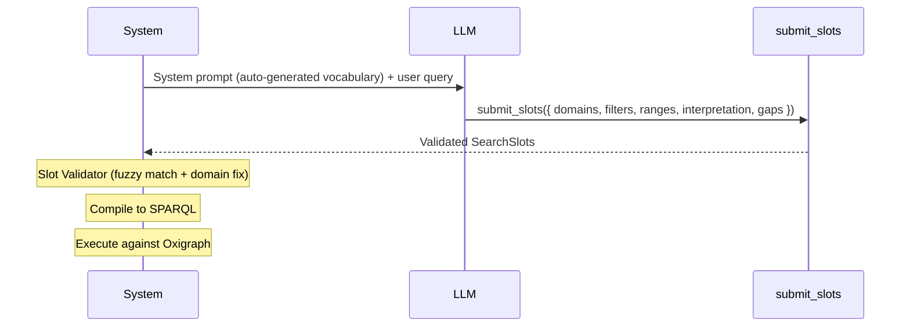
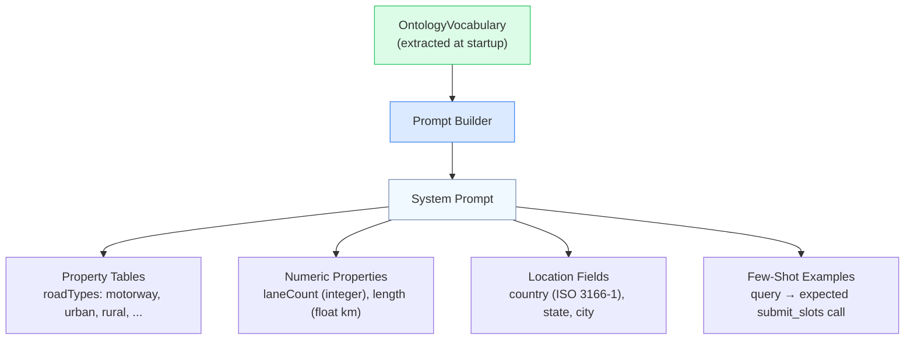
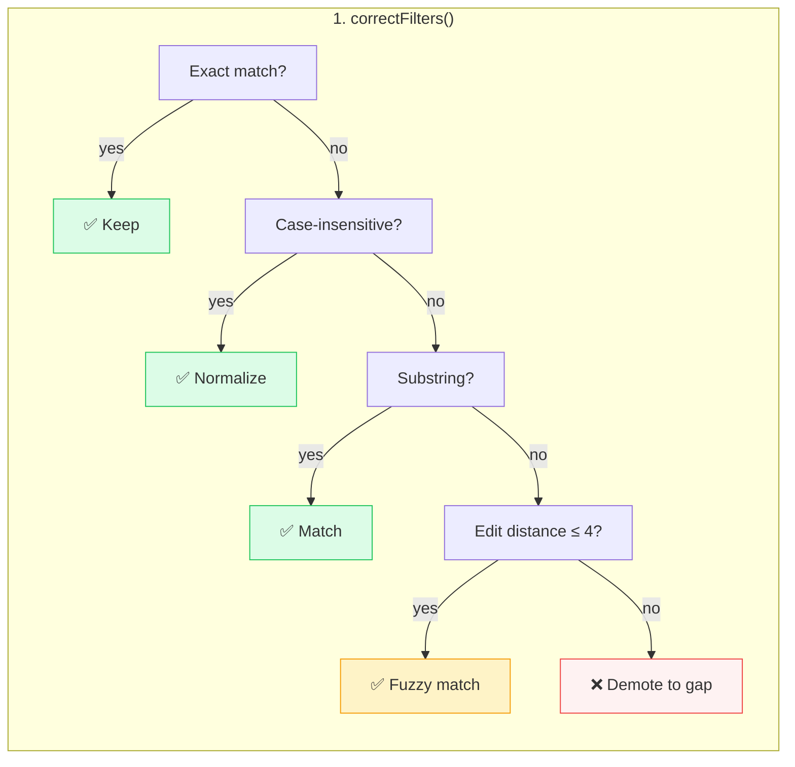

# Agent Design

Constrained tool-use pattern for reliable structured output.

## Single-Tool Agent

The agent has exactly one tool: **`submit_slots`**. This constrains the LLM to produce valid, typed search parameters rather than free-form text or raw SPARQL.



### Tool Schema

```typescript
submit_slots({
  slots: {
    domains: string[],        // ["hdmap"], ["scenario"], or ["hdmap", "scenario"]
    filters: {                // Enum property filters
      roadTypes?: string,     // "motorway" | "urban" | "rural" | ...
      formatType?: string,    // "ASAM OpenDRIVE" | "lanelet2" | ...
      country?: string,       // "DE" | "US" | "JP" | ...
      // ... any sh:in property
    },
    ranges: {                 // Numeric property ranges
      laneCount?: { min?: number, max?: number },
      length?: { min?: number, max?: number },
      // ... any sh:datatype numeric property
    },
    location?: { country?, state?, city? },
    license?: string
  },
  interpretation: string,     // Human-readable summary
  gaps: [{                    // Terms not in ontology
    term: string,
    reason: string,
    suggestions?: string[]
  }]
})
```

## Context Engineering

The system prompt is **auto-generated from the ontology vocabulary** — it contains exactly what the LLM needs to make correct mappings:



### What the prompt includes

| Section                       | Purpose                                               |
| ----------------------------- | ----------------------------------------------------- |
| Domain vocabulary tables      | All valid enum values per property, grouped by domain |
| Numeric property descriptions | Data type, units, ranges                              |
| Location field instructions   | ISO codes, free-text allowed                          |
| Mapping rules                 | "Use exact values from the tables above"              |
| Gap reporting rules           | "Report unmatched terms with reason and suggestions"  |
| Few-shot examples             | 3 example queries with expected tool-call output      |

## Post-LLM Validation Pipeline

After the LLM submits slots, three validation steps run:



### Domain Correction

When the LLM picks the wrong domain (e.g., `scenario` when filters are `roadTypes`, `country`), the validator:

1. Looks up each filter property's domain from the vocabulary index
2. If all filter properties belong to domain X but LLM chose domain Y → replaces with X
3. If filters span multiple domains → merges all required domains

### Confidence Recomputation

The validator removes LLM bias from confidence scores and recomputes objectively:

| Match type               | Confidence | Example                              |
| ------------------------ | ---------- | ------------------------------------ |
| Exact `sh:in` match      | **high**   | `"motorway"` in roadTypes vocabulary |
| Case-insensitive match   | **high**   | `"Motorway"` → `"motorway"`          |
| Substring match          | **medium** | `"motorways"` → `"motorway"`         |
| Edit-distance match (≤4) | **medium** | `"motoway"` → `"motorway"`           |
| No match                 | **gap**    | `"ADAS testing"` → reported as gap   |

## Provider Flexibility

The agent logic works with multiple LLM providers — same validation pipeline, different backends:

| Provider           | SDK                                 | Use Case                           |
| ------------------ | ----------------------------------- | ---------------------------------- |
| **GitHub Copilot** | Copilot SDK (`@github/copilot-sdk`) | Enterprise, integrated with GitHub |
| **OpenAI**         | Vercel AI SDK                       | Cloud-hosted, highest quality      |
| **Ollama**         | Vercel AI SDK                       | Local, privacy-first, no API costs |

Configured via `AI_PROVIDER` environment variable. Both agent paths share the same post-LLM validation pipeline.
