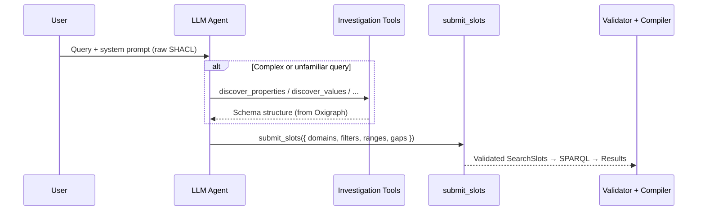
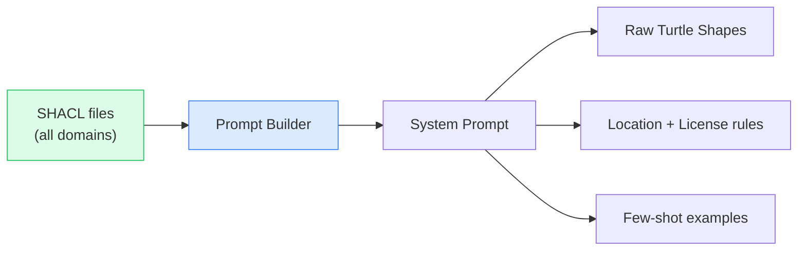

# Agent Design

Multi-tool agent with constrained output and runtime schema reasoning.

## Tool Architecture

The agent has **6 tools**: one output tool (`submit_slots`) and five investigation tools for runtime ontology exploration. The LLM never writes SPARQL — it fills structured slots or queries the schema graph.



### submit_slots Schema

```typescript
submit_slots({
  slots: {
    domains: string[],                                       // Asset types to search
    filters: Record<string, string | string[]>,              // Enum filters (any sh:in property,
                                                              //   including country / region /
                                                              //   license — all keyed by SHACL
                                                              //   leaf local name, no special-case
                                                              //   `location` or `license` slots)
    ranges: Record<string, { min?: number; max?: number }>,  // Numeric ranges
    references?: { domain: string }                          // Cross-domain JOIN to another
                                                              //   asset class (SHACL-discovered)
  },
  interpretation: string,                                    // Human-readable summary
  gaps: [{ term, reason, suggestions? }]                     // Unresolvable terms; suggestions
                                                              //   come from tokenised match
                                                              //   against the real vocabulary
})
```

Slot shape changed in the 2026-05-26 audit: there are no longer top-level `location` or `license` objects — both flow through `filters` keyed by the SHACL leaf local name (e.g. `country`, `region`, `license`). The new `references` slot binds one cross-domain JOIN whose target is a SHACL-discovered asset class. When the LLM nominates multiple cross-domain references, the dropped ones surface as honest `OntologyGap`s explaining the single-slot constraint.

### Forced tool choice

The agent runs with `toolChoice: { type: 'tool', toolName: 'submit_slots' }` — the LLM commits to structured output on step 1. The five investigation tools are still wired in (the prompt mentions them) but are no longer the path of least resistance: the full SHACL is embedded in the system prompt, so investigation calls are typically redundant. Forcing the choice eliminated a class of failures where cautious models (Haiku, in particular) exhausted `LLM_MAX_AGENT_STEPS` on `discover_*` calls and never reached `submit_slots`.

## Context Engineering

The system prompt is **auto-generated from raw SHACL shapes** at startup. The LLM reads native Turtle directly:



### Why raw SHACL in the prompt

The LLM natively understands SHACL constraint vocabulary:

- **`sh:in (...)`** — allowed values → synonym resolution
- **`sh:pattern`** — format constraints (ISO codes, etc.)
- **`sh:datatype xsd:integer`** → range queries
- **`sh:description`** — semantic context for disambiguation

No properties can be missed because the LLM sees the full shapes. The investigation tools supplement this with on-demand exploration for edge cases.

## Post-LLM Validation

Three corrections run after the LLM submits slots:


| Correction     | Logic                                                          | Example                                 |
| -------------- | -------------------------------------------------------------- | --------------------------------------- |
| **Filter**     | Exact → case-insensitive → substring → edit-distance ≤ 4 → gap | `"motoway"` → `"motorway"`              |
| **Domain**     | Property→domain map; add missing, keep valid                   | `scenario` + `roadTypes` → adds `hdmap` |
| **Confidence** | Recompute from match quality, not LLM self-assessment          | Exact = high, fuzzy = medium            |

## Investigation Tools (RDF Reasoning)

Five tools query the schema graph (`<urn:graph:schema>`) at runtime, giving the LLM on-demand ontology exploration:

| Tool                   | Purpose                               | Returns                            |
| ---------------------- | ------------------------------------- | ---------------------------------- |
| `discover_domains`     | List searchable asset types           | `[{domain, classIri}]`             |
| `discover_properties`  | Filterable properties for a domain    | `[{localName, datatype, hasEnum}]` |
| `discover_values`      | Allowed `sh:in` values for a property | `["motorway", "rural", ...]`       |
| `discover_connections` | Cross-domain references               | `[{from, to}]`                     |
| `investigate_schema`   | Arbitrary SPARQL SELECT on schema     | `[{var1, var2, ...}]`              |

**Safety:** Read-only, SELECT-only, 50-row cap, no interactive permissions.

**When used:** Most queries resolve from the static prompt alone. Tools activate for niche properties, unfamiliar concepts, or complex cross-domain exploration.

## Provider Flexibility

| Provider           | SDK                       | Use Case                                                   |
| ------------------ | ------------------------- | ---------------------------------------------------------- |
| **GitHub Copilot** | `@github/copilot-sdk`     | Enterprise, GitHub-integrated                              |
| **OpenAI**         | Vercel AI SDK             | Cloud, highest quality                                     |
| **Anthropic**      | `@ai-sdk/anthropic`       | Direct Claude API access                                   |
| **claude-cli**     | `@ai-sdk/anthropic` + CLI | Reuses the local `claude` CLI's OAuth session (no API key) |
| **vibe-cli**       | `@ai-sdk/openai`-compat   | Routes through the local `vibe` CLI (Mistral models)       |
| **Ollama**         | Vercel AI SDK             | Local, privacy-first                                       |

All providers share the same validation pipeline. Selected via the `AI_PROVIDER` env var; the model is selected by `AI_MODEL`.

### Tuning knobs

| Env var               | Default | Notes                                                                                                                      |
| --------------------- | ------- | -------------------------------------------------------------------------------------------------------------------------- |
| `LLM_TEMPERATURE`     | `0`     | Slot filling is extraction, not generation. Variance is just noise — default is greedy decoding.                           |
| `LLM_THINKING_BUDGET` | `0`     | Token budget for Anthropic's `thinking` block (claude-cli/anthropic only). Other providers select reasoning by model name. |
| `LLM_MAX_AGENT_STEPS` | `3`     | Hard cap on tool-call rounds. With `toolChoice` forcing `submit_slots`, the typical query needs 1 step.                    |

Reasoning mode by provider: Mistral uses the `magistral-*` family, OpenAI uses the `o`-series model names (`o1`, `o4-mini`), Anthropic exposes a typed `thinking` block — `LLM_THINKING_BUDGET` is the only var that surfaces it explicitly.
