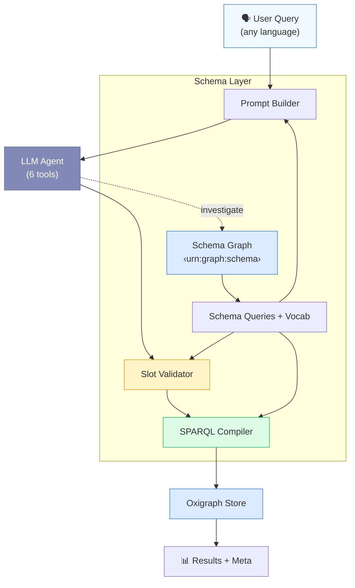
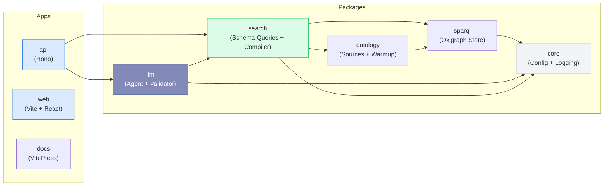
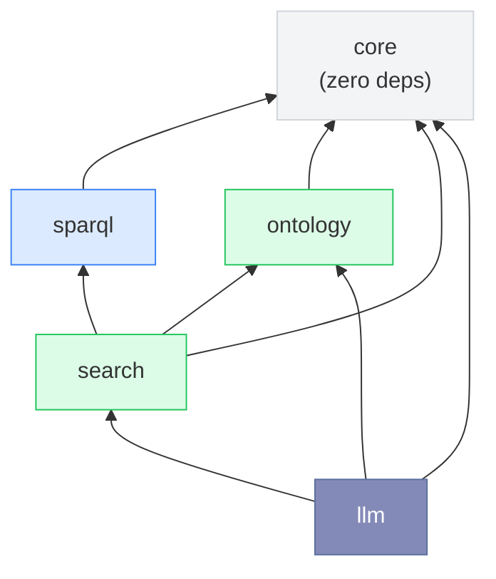
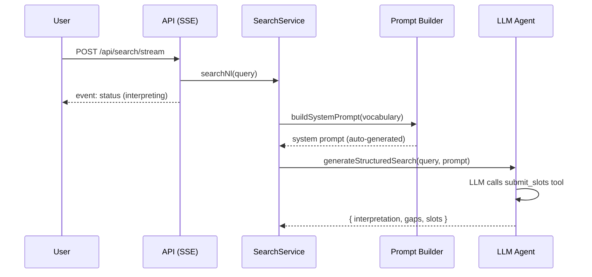
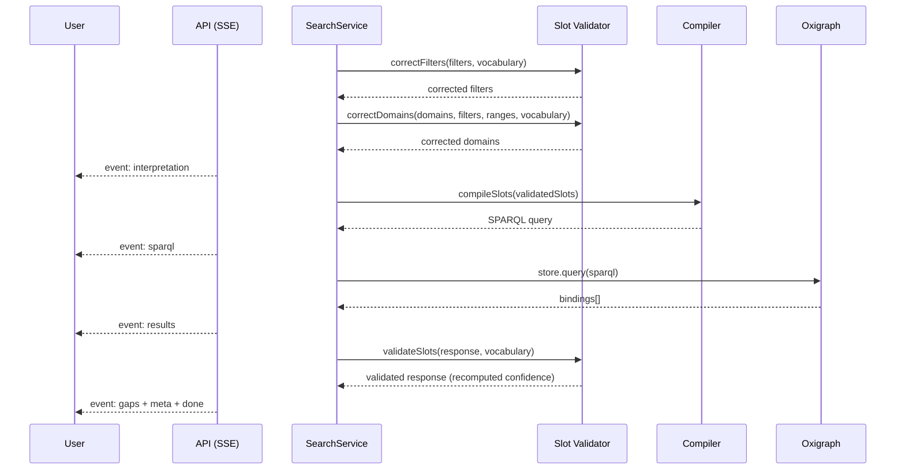

# System Architecture

## Pipeline Overview

The system converts natural language queries into precise SPARQL queries grounded in OWL + SHACL domain ontologies. The pipeline is designed around one core principle: **the LLM fills structured slots — it never writes SPARQL**. Compiler metadata is derived from the schema graph via `schema-queries.ts`, which builds a `CompilerVocab` with property/domain mappings, shape groups, and Range2D properties.

A second pipeline runs alongside the compiler: at warmup, `reference-index.ts` discovers every cross-asset reference signature `(sourceClass, predicatePath, targetClass)` by BFS over typed instances; `metadata-index.ts` snapshots the per-asset shape-group facets and computes per-domain aggregates. Together they back the WP3 traceability layer — per-row predicate-chain breadcrumbs, the multi-hop `/traceability` lineage endpoint, and the `/metadata/{asset,aggregate}` facet endpoints.

## Module Boundaries

The application is a **pnpm monorepo** with Turborepo orchestration. Each package has a single responsibility and clear dependency direction.

### Package Responsibilities

| Package                     | Module                         | Role                                                                                                          |
| --------------------------- | ------------------------------ | ------------------------------------------------------------------------------------------------------------- |
| `@ontology-search/core`     | `config/`                      | Zod-validated env config                                                                                      |
|                             | `logging/`                     | Structured JSON logger with correlation IDs                                                                   |
|                             | `errors/`                      | Shared error types and base classes                                                                           |
| `@ontology-search/sparql`   | `oxigraph-store.ts`            | Oxigraph WASM wrapper, SPARQL execution                                                                       |
|                             | `remote-store.ts`              | HTTP client for any SPARQL 1.1 endpoint                                                                       |
|                             | `cached-store.ts`              | LRU query cache decorator (wraps either store)                                                                |
|                             | `cache.ts`                     | LRU cache implementation                                                                                      |
|                             | `policy.ts`                    | Query validation policies                                                                                     |
| `@ontology-search/ontology` | `warmup.ts`                    | Loads instance TTL data at startup                                                                            |
|                             | `paths.ts`                     | Resolves project root and ontology file paths                                                                 |
|                             | `domain-registry.ts`           | Domain lookups and registration                                                                               |
|                             | `vocabulary-index.ts`          | Vocabulary indexing for property → domain mapping                                                             |
| `@ontology-search/search`   | `schema-loader.ts`             | Loads 45 OWL+SHACL files into `<urn:graph:schema>`                                                            |
|                             | `schema-queries.ts`            | Graph-driven SPARQL helpers for domains, references, and shape groups                                         |
|                             | `property-paths.ts`            | Discovers predicate chains from SHACL (ontology-agnostic)                                                     |
|                             | `vocabulary-extractor.ts`      | SPARQL-based extraction of `sh:in` enums + numeric props                                                      |
|                             | `reference-index.ts`           | WP3: BFS-discovered `(source, predicate, target)` reference signatures                                        |
|                             | `metadata-index.ts`            | WP3: per-asset facet snapshot + per-domain aggregate distribution                                             |
|                             | `compiler.ts`                  | `compileSlots` + `compileSlotsWithTrace` (the trace variant binds intermediate JOIN vars for per-row lineage) |
|                             | `sparql-validator.ts`          | Post-compilation SPARQL syntax validation                                                                     |
|                             | `service.ts`                   | Orchestrates init → interpret → compile → execute                                                             |
|                             | `factory.ts`                   | Service factory and dependency wiring                                                                         |
|                             | `slots.ts`                     | SearchSlots type definitions (flattened — no `location`/`license` slots; new `references` slot)               |
|                             | `data-loader.ts`               | Loads sample TTL + JSON-LD files for dev/test                                                                 |
|                             | `init.ts`                      | Initialization sequence                                                                                       |
| `@ontology-search/llm`      | `prompt-builder.ts`            | Auto-generates LLM system prompt from raw SHACL                                                               |
|                             | `slot-validator.ts`            | Post-LLM validation: tokenised fuzzy match, multi-domain correction, gap enrichment                           |
|                             | `agent/copilot-agent.ts`       | Copilot SDK agent path + investigation tools                                                                  |
|                             | `agent/index.ts`               | Vercel AI SDK agent path (5 providers; `toolChoice` forces `submit_slots`)                                    |
|                             | `agent/submission-router.ts`   | Dispatches the LLM submission to the appropriate post-processing pipeline                                     |
|                             | `agent/run-slot-pipeline.ts`   | Validates slots, enriches gaps, and emits honest dropped-reference gaps                                       |
|                             | `agent/tools.ts`               | `submit_slots` tool definition                                                                                |
|                             | `agent/investigation-tools.ts` | 5 schema discovery tools (kept available; rarely used now)                                                    |
| `@ontology-search/api`      | `routes/search.ts`             | Hono SSE streaming endpoint (search + refine)                                                                 |
|                             | `routes/traceability.ts`       | WP3: `GET /traceability?asset=<iri>&depth=N` — multi-hop lineage walk                                         |
|                             | `routes/metadata.ts`           | WP3: `GET /metadata/asset` (per-asset facets) and `/metadata/aggregate` (per-domain stats)                    |
|                             | `routes/stats.ts`              | Statistics endpoint                                                                                           |
|                             | `warmup.ts`                    | Startup orchestration (load ontology, init store, warm reference + metadata indices)                          |
| `@ontology-search/testing`  | `helpers/`                     | Shared test utilities (mock logger, fixtures)                                                                 |

### Dependency Rules

Packages follow a strict layered dependency direction — no circular dependencies allowed:

- **`core`** has zero workspace dependencies — it is the shared foundation
- **`sparql`** and **`ontology`** depend only on `core`
- **`search`** depends on `core`, `sparql`, and `ontology`
- **`llm`** depends on `core`, `ontology`, and `search`
- **Apps** (`api`, `web`) compose packages — packages never depend on apps
- **`testing`** provides shared test utilities — not used in production code

## Ontology-Agnostic Design

The system is designed to work with **any set of OWL + SHACL ontologies** — no hardcoded domain names, predicates, or class IRIs exist in production code. All structure is discovered at runtime from the schema graph.

### Graph-Driven Discovery

| Component               | What It Discovers                  | Source                               |
| ----------------------- | ---------------------------------- | ------------------------------------ |
| **Domain Registry**     | Asset types (hdmap, scenario, ...) | `rdfs:subClassOf` + `sh:targetClass` |
| **Property Paths**      | Predicate chains (asset → leaf)    | `sh:property` / `sh:node` traversal  |
| **Schema Queries**      | Shape groups, cross-domain refs    | SPARQL against `<urn:graph:schema>`  |
| **Investigation Tools** | Anything — LLM explores at runtime | Ad-hoc SPARQL SELECT                 |

### RDF Reasoning Capability

The LLM has **5 investigation tools** that query the schema graph using SPARQL. This enables runtime ontology exploration beyond the static prompt — the LLM can verify concepts, discover relationships, and explore property hierarchies before filling slots.

See: [Generic Design](/generic-design) for the full architecture of the ontology-agnostic approach, property path discovery, and RDF reasoning capabilities.

## Data Flow (Swim Lane)

### Request Phase

### Execution Phase

## Security Model

The system is designed with defense-in-depth — no single layer failure can produce arbitrary queries:

::: info LLM Never Writes SPARQL
The agent fills structured slots via a single tool (`submit_slots`). The compiler generates SPARQL deterministically. No prompt injection can produce arbitrary queries.
:::

::: warning Slot Validation
Every filter value is validated against `sh:in` vocabulary from the ontology. Unknown values are rejected or fuzzy-matched to the nearest valid term. Domain mismatches are corrected automatically.
:::

::: tip Zod Validation
All API inputs are validated with Zod schemas. Configuration is validated at startup. No untyped data flows through the system.
:::
