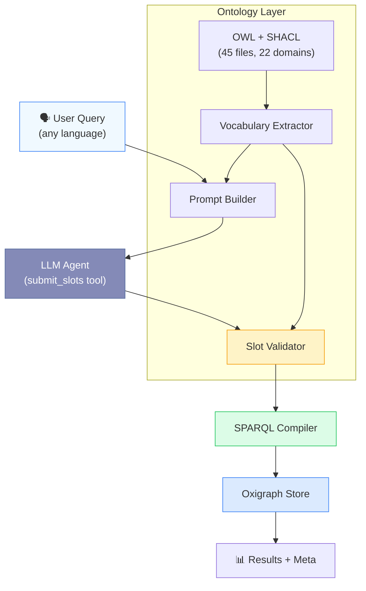
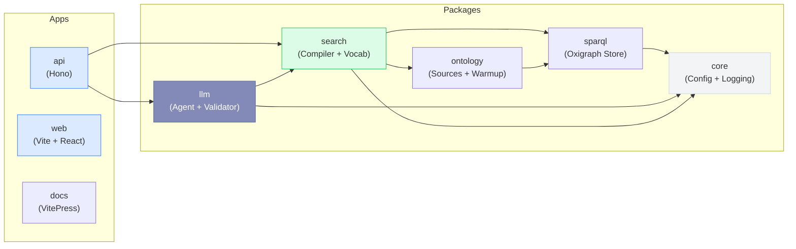
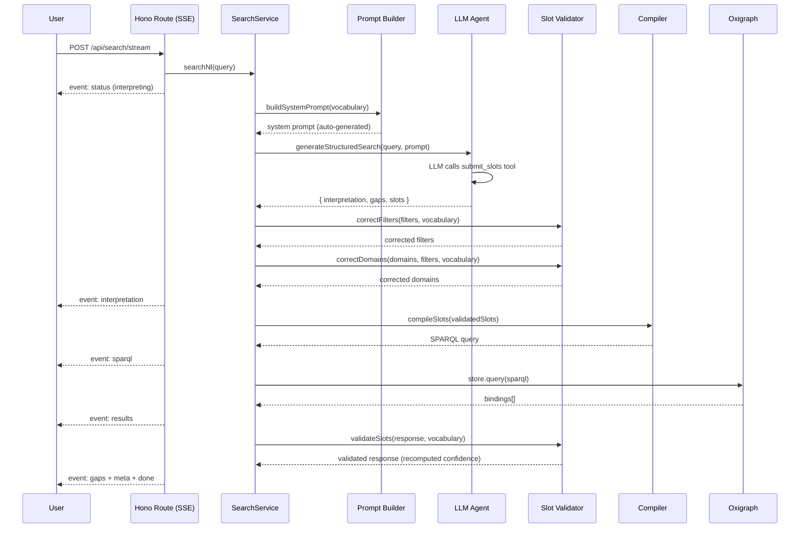

# System Architecture

## Pipeline Overview

The system converts natural language queries into precise SPARQL queries grounded in OWL + SHACL domain ontologies. The pipeline is designed around one core principle: **the LLM fills structured slots — it never writes SPARQL**.

## Module Boundaries

The application is a **pnpm monorepo** with Turborepo orchestration. Each package has a single responsibility and clear dependency direction.

### Package Responsibilities

| Package                     | Module                    | Role                                                      |
| --------------------------- | ------------------------- | --------------------------------------------------------- |
| `@ontology-search/core`     | `config/`                 | Zod-validated env config                                  |
|                             | `logging/`                | Structured JSON logger with correlation IDs               |
| `@ontology-search/sparql`   | `store.ts`                | Oxigraph WASM wrapper, SPARQL execution                   |
| `@ontology-search/ontology` | `warmup.ts`               | Loads instance TTL data at startup                        |
|                             | `sources.ts`              | Resolves ontology file paths from `ontology-sources.json` |
| `@ontology-search/search`   | `schema-loader.ts`        | Loads 45 OWL+SHACL files into `<urn:graph:schema>`        |
|                             | `vocabulary-extractor.ts` | SPARQL-based extraction of `sh:in` enums + numeric props  |
|                             | `compiler.ts`             | SearchSlots → deterministic SPARQL                        |
|                             | `service.ts`              | Orchestrates init → interpret → compile → execute         |
| `@ontology-search/llm`      | `prompt-builder.ts`       | Auto-generates LLM system prompt from vocabulary          |
|                             | `slot-validator.ts`       | Post-LLM validation: fuzzy match, domain correction       |
|                             | `agent/copilot-agent.ts`  | Copilot SDK agent path                                    |
|                             | `agent/index.ts`          | Vercel AI SDK agent path (OpenAI/Ollama)                  |
| `@ontology-search/api`      | `routes/search.ts`        | Hono SSE streaming endpoint                               |

## Data Flow (Swim Lane)

## Security Model

The system is designed with defense-in-depth — no single layer failure can produce arbitrary queries:

::: info LLM Never Writes SPARQL
The agent fills structured slots via a single tool (`submit_slots`). The compiler generates SPARQL deterministically. No prompt injection can produce arbitrary queries.
:::

::: warning Slot Validation
Every filter value is validated against `sh:in` vocabulary from the ontology. Unknown values are rejected or fuzzy-matched to the nearest valid term. Domain mismatches are corrected automatically.
:::

::: tip Zod Validation
All API inputs are validated with Zod schemas. Configuration is validated at startup. No untyped data flows through the system.
:::
