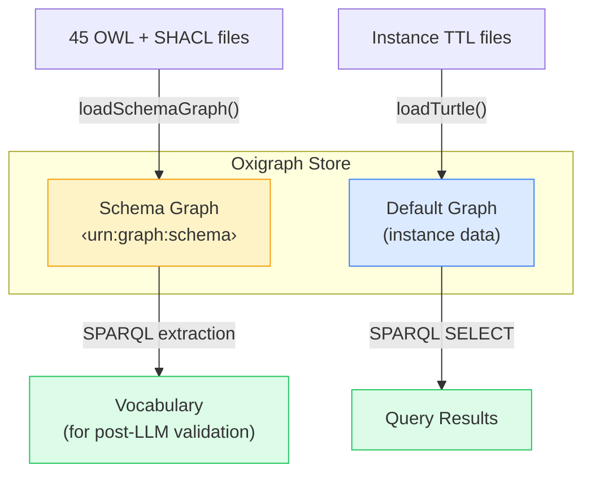

# Data Model

Sample datasets and the knowledge graph structure.

## Dual Graph Architecture

The system uses a single Oxigraph store with **two named graphs**:



### Schema Graph (`<urn:graph:schema>`)

Contains the **ontology definitions** — OWL class hierarchies, SHACL shapes with `sh:in` value constraints, property definitions. Raw SHACL files are read directly for the LLM prompt (via SHACL reader), and vocabulary is extracted via SPARQL for post-LLM slot validation. Never queried at search time.

### Default Graph (instance data)

Contains **167 simulation assets** — the actual data that users search:

| Asset Type | Count | Example Properties                                |
| ---------- | :---: | ------------------------------------------------- |
| HD Maps    |  117  | roadTypes, laneCount, formatType, country, length |
| Scenarios  |  50   | scenarioCategory, weather, timeOfDay              |

## RDF Structure

Each asset follows the ENVITED-X pattern:

```turtle
# An HD Map asset
manifest:asset-autobahn-a9 a gx:ServiceOffering ;
  rdfs:label "Autobahn A9 Munich-Nuremberg" ;
  manifest:hasDomainSpecification manifest:ds-autobahn-a9 .

# Domain specification links to content, format, georeference
manifest:ds-autobahn-a9
  hdmap:hasContent manifest:content-a9 ;
  hdmap:hasFormat manifest:format-a9 ;
  hdmap:hasGeoreference manifest:geo-a9 .

# Content properties
manifest:content-a9
  hdmap:roadTypes "motorway" ;
  hdmap:laneCount 3 ;
  hdmap:trafficDirection "right-hand" .

# Format properties
manifest:format-a9
  hdmap:formatType "ASAM OpenDRIVE" .

# Georeference properties
manifest:geo-a9
  georeference:hasProjectLocation manifest:loc-a9 .
manifest:loc-a9
  georeference:country "DE" ;
  georeference:region "Bavaria" .
```

## Dataset Sources

Data is loaded from TTL files configured in `ontology-sources.json`:

```json
{
  "sources": [
    {
      "name": "ontology-management-base",
      "path": "submodules/hd-map-asset-example/submodules/sl-5-8-asset-tools/submodules/ontology-management-base/artifacts",
      "description": "ASCS ontology-management-base containing HD map, georeference, scenario, and other domain ontologies"
    }
  ]
}
```

## SPARQL Store Abstraction

The `SparqlStore` interface decouples the application from any specific triplestore:

```typescript
interface SparqlStore {
  query(sparql: string): Promise<SparqlResults>
  update(sparql: string): Promise<void>
  loadTurtle(data: string, graphUri?: string): Promise<void>
  loadJsonLd(data: string, graphUri?: string): Promise<void>
  isReady(): Promise<boolean>
}
```

| Implementation        | Description                                      |
| --------------------- | ------------------------------------------------ |
| **OxigraphStore**     | WASM-based, runs in-process, zero infrastructure |
| **RemoteSparqlStore** | HTTP client for any SPARQL 1.1 endpoint          |
| **CachedSparqlStore** | LRU query cache decorator (wraps either)         |

## Query Results

SPARQL SELECT queries return bindings as key-value pairs, streamed via SSE:

```json
[
  {
    "asset": "manifest:asset-autobahn-a9",
    "name": "Autobahn A9 Munich-Nuremberg",
    "roadTypes": "motorway",
    "country": "DE"
  },
  {
    "asset": "manifest:asset-i95",
    "name": "US Interstate I-95 Section",
    "roadTypes": "interstate",
    "country": "US"
  }
]
```
