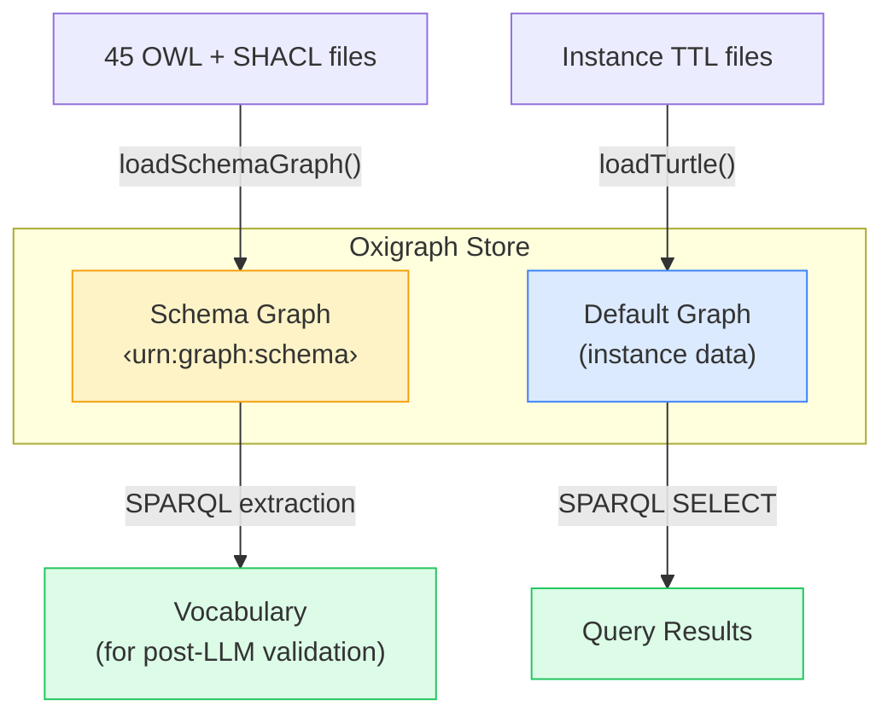

# Data Model

Sample datasets and the knowledge graph structure.

## Dual Graph Architecture

The system uses a single Oxigraph store with **two named graphs**:



### Schema Graph (`<urn:graph:schema>`)

Contains the **ontology definitions** — OWL class hierarchies, SHACL shapes with `sh:in` value constraints, property definitions. Raw SHACL files are read directly for the LLM prompt (via SHACL reader), and `schema-queries.ts` runs SPARQL against this graph to derive asset domains, domain references, shape groups, and other compiler metadata.

### Default Graph (instance data)

Contains **267 simulation assets** — the actual data that users search:

| Asset Type         | Count | Example Properties                                |
| ------------------ | :---: | ------------------------------------------------- |
| HD Maps            |  117  | roadTypes, laneCount, formatType, country, length |
| Scenarios          |  50   | scenarioCategory, weather, timeOfDay              |
| OSI Traces         |  50   | roadTypes, granularity, fileFormat, numberFrames  |
| Environment Models |  30   | terrainType, vegetationType, weatherCondition     |
| Surface Models     |  20   | materialType, frictionCoefficient, textureFormat  |

## RDF Structure

Each asset follows the ENVITED-X pattern:

```turtle
# An HD Map asset
<did:web:provider35.net:HdMap:karlsruhe-parking-garage-001> a hdmap:HdMap ;
  rdfs:label "Karlsruhe Parking Garage HD Map"@en ;
  hdmap:hasResourceDescription [
    a envited-x:ResourceDescription ;
    gx:name "Karlsruhe Parking Garage HD Map" ;
    gx:license "CC0-1.0"
  ] ;
  hdmap:hasDomainSpecification [
    a hdmap:DomainSpecification ;
    hdmap:hasContent [
      a hdmap:Content ;
      hdmap:roadTypes "custom" ;
      hdmap:laneCount 3 ;
      hdmap:trafficDirection "right-hand"
    ] ;
    hdmap:hasFormat [
      a hdmap:Format ;
      hdmap:formatType "Lanelet2"
    ] ;
    hdmap:hasGeoreference [
      a georeference:Georeference ;
      georeference:hasProjectLocation [
        a georeference:ProjectLocation ;
        georeference:country "DE" ;
        georeference:region "Baden-Wuerttemberg"
      ]
    ]
  ] .
```

## Dataset Sources

Ontology schema files are resolved from `ontology-sources.json`. Runtime sample instance data is loaded by `packages/search/src/data-loader.ts` from 5 TTL files in `packages/search/data/`:

- `sample-assets.ttl` — 117 HD maps
- `sample-scenarios.ttl` — 50 scenarios
- `sample-ositrace.ttl` — 50 OSI traces
- `sample-environment-models.ttl` — 30 environment models
- `sample-surface-models.ttl` — 20 surface models

## SPARQL Store Abstraction

The `SparqlStore` interface decouples the application from any specific triplestore:

```typescript
interface SparqlStore {
  query(sparql: string): Promise<SparqlResults>
  update(sparql: string): Promise<void>
  loadTurtle(data: string, graphUri?: string): Promise<void>
  loadJsonLd(data: string, graphUri?: string): Promise<void>
  isReady(): Promise<boolean>
}
```

| Implementation        | Description                                      |
| --------------------- | ------------------------------------------------ |
| **OxigraphStore**     | WASM-based, runs in-process, zero infrastructure |
| **RemoteSparqlStore** | HTTP client for any SPARQL 1.1 endpoint          |
| **CachedSparqlStore** | LRU query cache decorator (wraps either)         |

## Query Results

SPARQL SELECT queries return bindings as key-value pairs, streamed via SSE:

```json
[
  {
    "asset": "manifest:asset-autobahn-a9",
    "name": "Autobahn A9 Munich-Nuremberg",
    "roadTypes": "motorway",
    "country": "DE"
  },
  {
    "asset": "manifest:asset-i95",
    "name": "US Interstate I-95 Section",
    "roadTypes": "interstate",
    "country": "US"
  }
]
```
