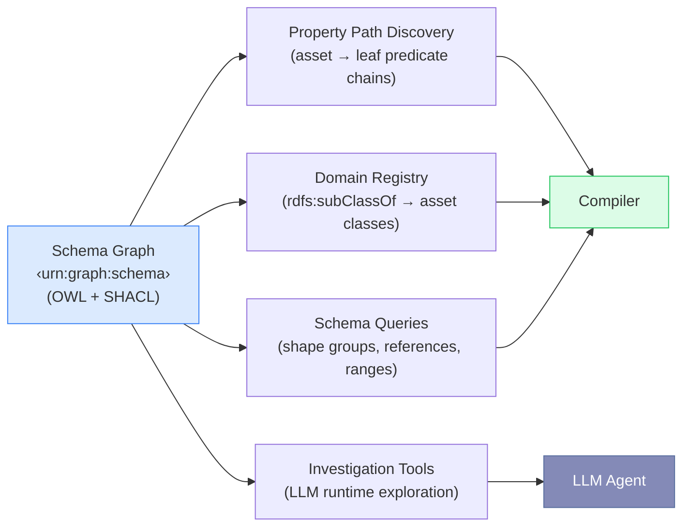
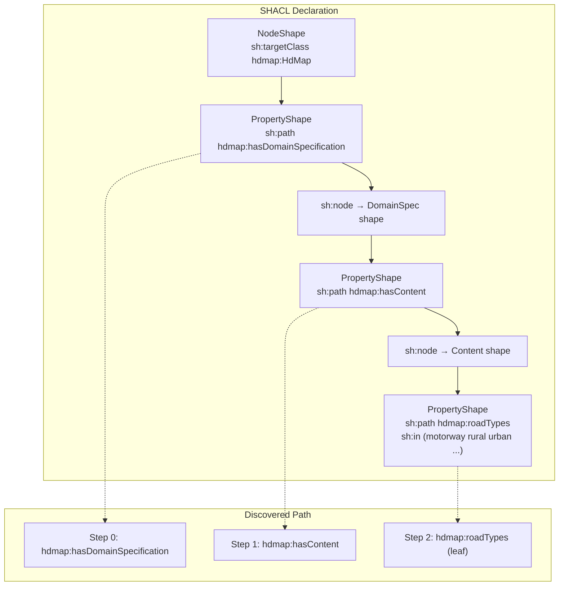
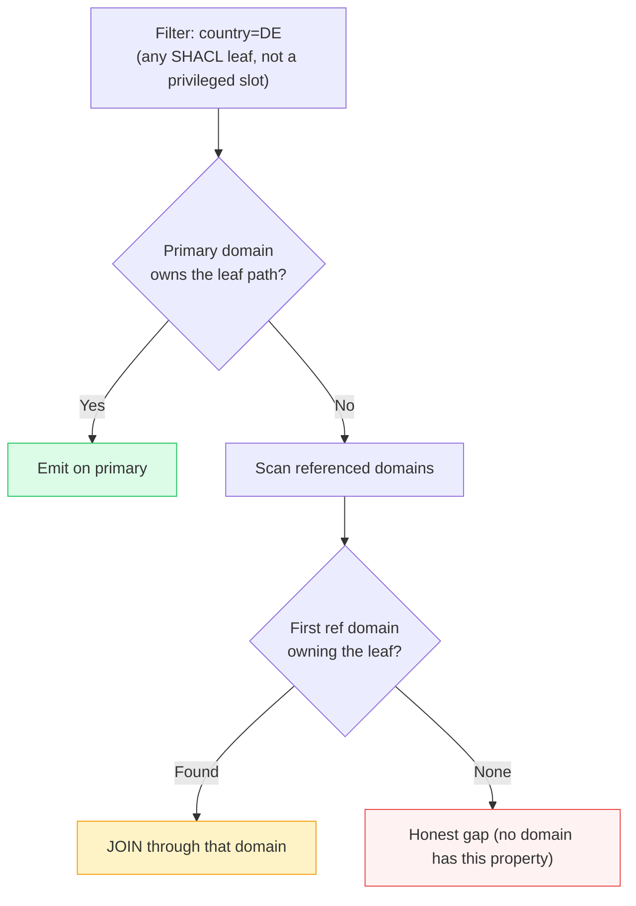
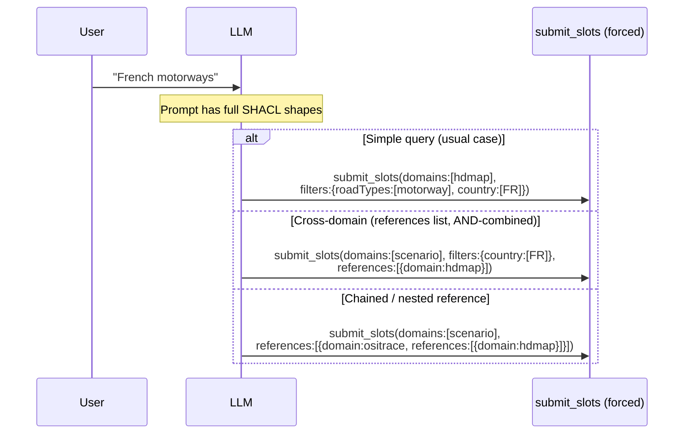
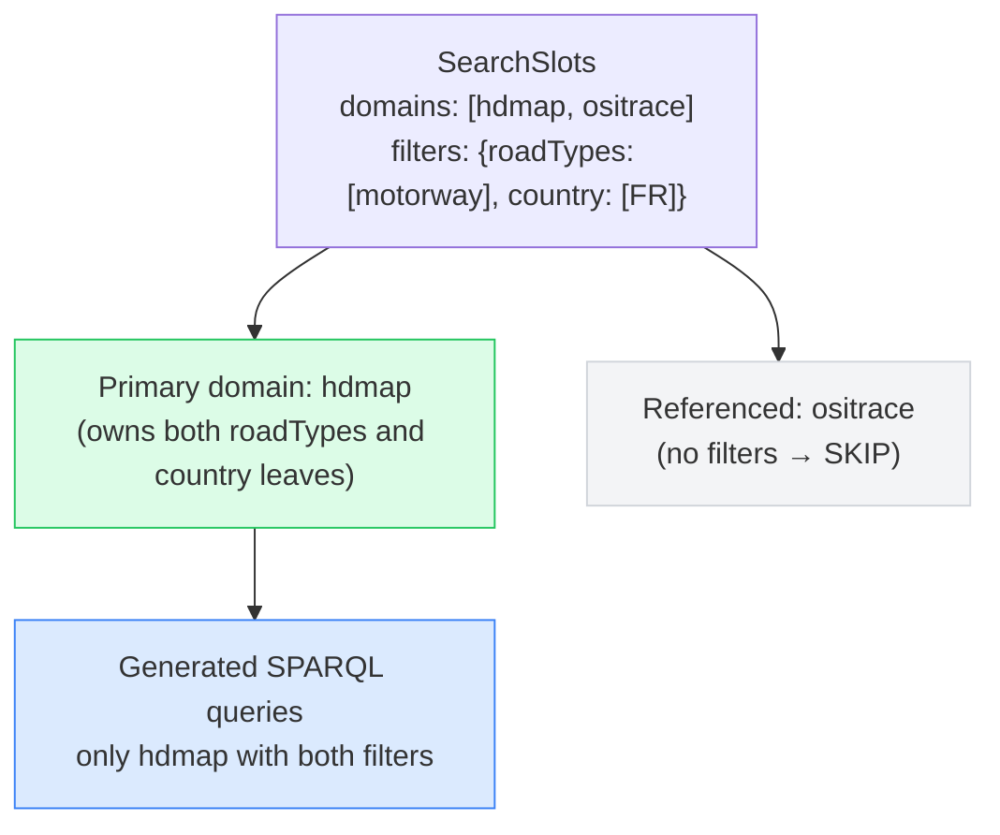

# Generic Ontology-Agnostic Design

## Design Principle

The system is **ontology-agnostic**: it works with any set of OWL + SHACL ontologies loaded into the schema graph. There are no hardcoded domain names, predicates, class IRIs, or property enumerations in production code. Everything is discovered at runtime from the schema.

::: tip Portability Example
Replace the ENVITED-X automotive simulation ontologies with a retail product ontology (`outdoor-shoes`, `winter-jackets`) — the same pipeline handles queries like "waterproof hiking boots under €100" without any code changes.
:::

## Graph-Driven Discovery

Instead of hardcoding knowledge about the ontology structure, every component queries the SHACL schema graph dynamically:

### What Is Discovered (not hardcoded)

| What                  | How                                                  | Example                                                       |
| --------------------- | ---------------------------------------------------- | ------------------------------------------------------------- |
| **Asset domains**     | `rdfs:subClassOf` + `sh:targetClass`                 | `hdmap`, `scenario`, `ositrace`                               |
| **Property paths**    | Walk `sh:property` / `sh:node` chains                | `Asset → hasDomainSpec → hasContent → roadTypes`              |
| **Allowed values**    | `sh:in` RDF lists                                    | `["motorway", "rural", "urban"]`                              |
| **Shape groups**      | `sh:property` → `sh:node` structure                  | `Content`, `Format`, `Quality`, `Quantity`                    |
| **Cross-domain refs** | `sh:class` pointing to another domain's target class | `scenario → hdmap`, `scenario → ositrace`                     |
| **Location chain**    | Property paths ending in `country`, `city`, etc.     | `DomainSpec → hasGeoreference → hasProjectLocation → country` |
| **Range properties**  | `sh:datatype xsd:integer/float` properties           | `laneCount`, `length`, `speedLimit`                           |

## Property Path Discovery

The compiler needs to know the predicate chain from an asset to each leaf property. Instead of hardcoding paths like `hasDomainSpecification → hasContent → roadTypes`, the system walks SHACL shapes:

The `buildPropertyPaths()` function produces one `PropertyPath` per (asset-class, leaf-property) pair. The compiler uses these paths to emit SPARQL triples without any ontology-specific knowledge.

## Filter Routing

Filters are key-value pairs keyed by SHACL leaf local name — `country`, `region`, `license`, `roadTypes`, `formatType`, and so on. There is no privileged `location` or `license` slot: country, state, region, city, and license all flow through the same map. The compiler resolves each filter against the discovered property-path graph:

1. For each `(filterKey, value)` pair, find every domain whose property paths end in a leaf named `filterKey`.
2. If the primary domain owns the path → emit the triple pattern on the primary.
3. If not → JOIN through the first referenced domain that owns it.
4. Referenced domains without any active filter are **not** joined (avoids over-constraint).

## Single-Tool Forced Choice

The agent exposes only `submit_slots` with forced tool choice. The LLM receives the full SHACL vocabulary in its system prompt and commits to structured output in a single round-trip:

The two cross-domain branches are distinct claims: flat siblings `[{ositrace}, {hdmap}]` mean the scenario references a trace **and** (independently) a map; the nested form `[{ositrace, references:[{hdmap}]}]` means scenario → trace → map (the map belongs to the trace). Both compile deterministically from discovered SHACL paths.

The key insight: **the system prompt embeds the full SHACL ontology** — the LLM has complete knowledge of domains, properties, allowed values, and cross-domain relationships without needing runtime exploration tools.

## Multi-Domain Query Architecture

When the LLM selects multiple domains, the compiler applies intelligent constraint routing:

**Rules:**

1. Filters apply only to the domain that owns the SHACL leaf path
2. Country / region / city / license route by leaf ownership too — no privileged location slot
3. Referenced domains without any constraints are **skipped** — no empty mandatory JOINs
4. This prevents the "over-constraint" problem where multi-domain selection returns zero results

## Ontology Budget Rule

The codebase enforces a **monotonically decreasing ontology-name budget**: every change must reduce (never increase) the number of ontology-specific identifiers in production source files. Tests may reference specific properties to assert behavior, but production code paths must not.

This ensures the generic design improves over time rather than accumulating domain-specific debt.
