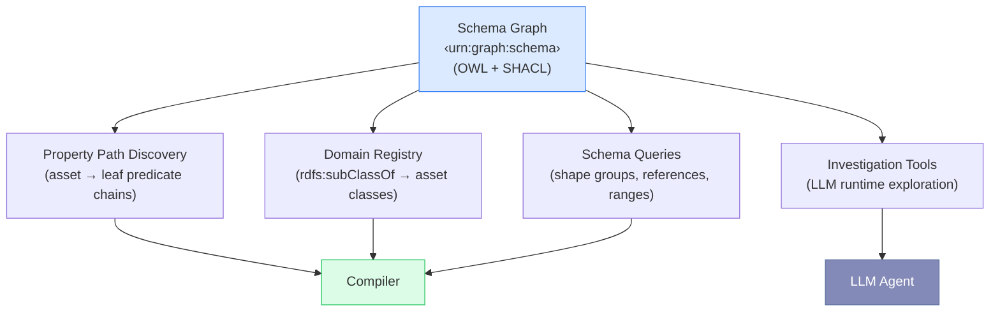
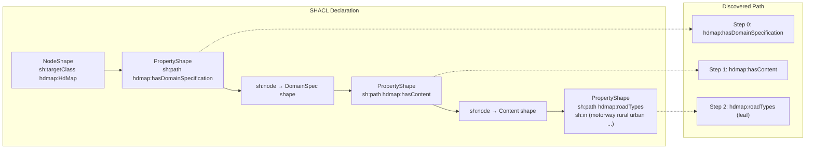
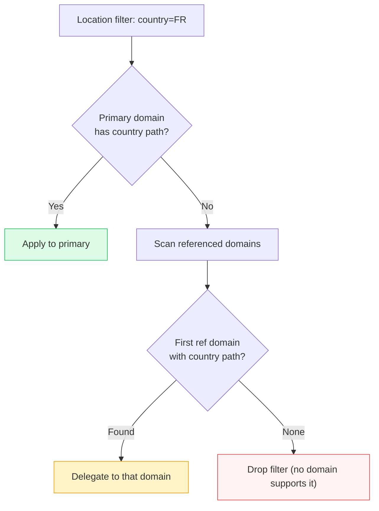
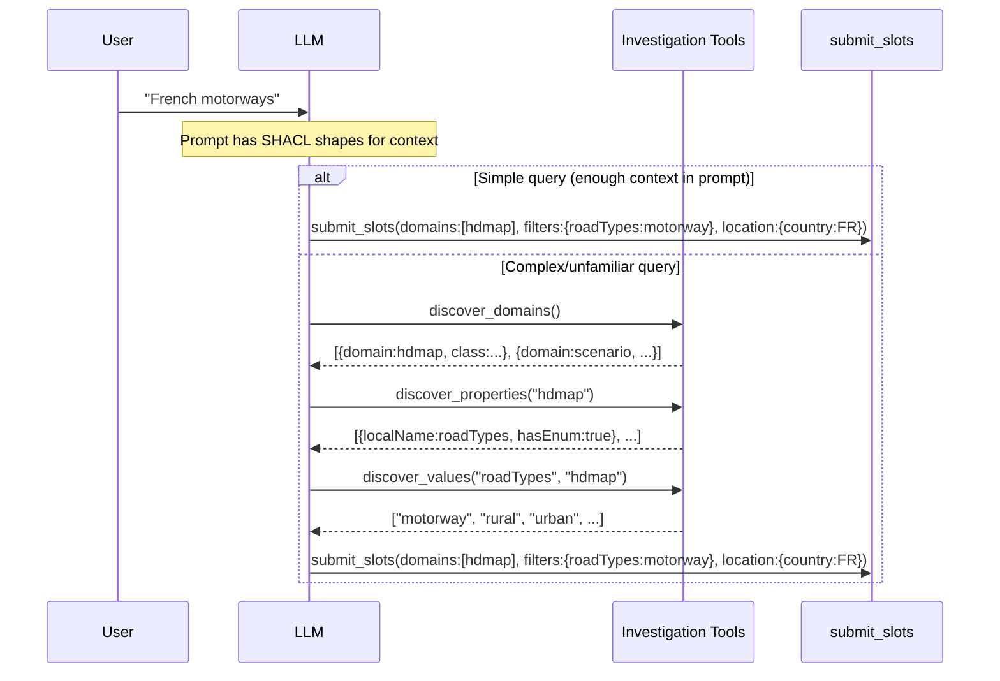
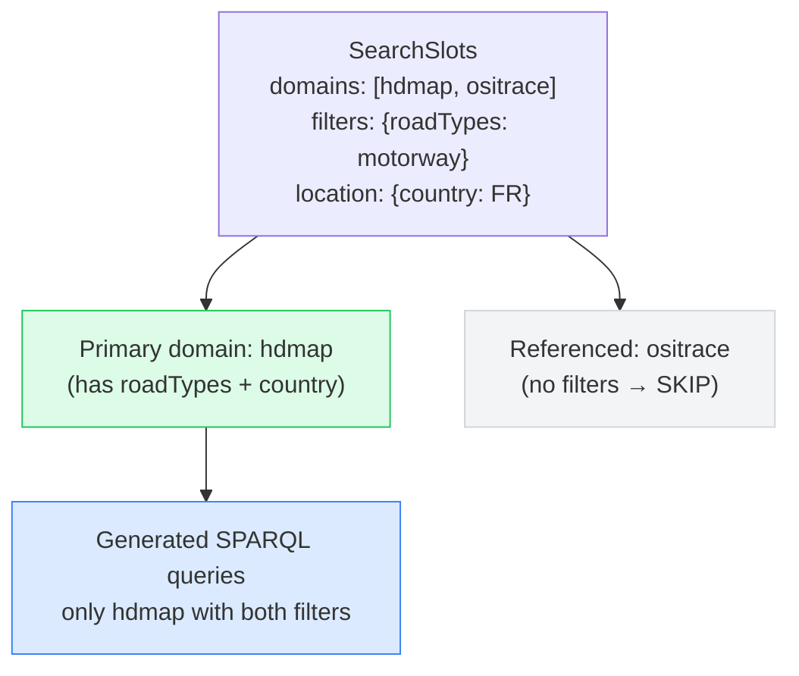

# Generic Ontology-Agnostic Design

## Design Principle

The system is **ontology-agnostic**: it works with any set of OWL + SHACL ontologies loaded into the schema graph. There are no hardcoded domain names, predicates, class IRIs, or property enumerations in production code. Everything is discovered at runtime from the schema.

::: tip Portability Example
Replace the ENVITED-X automotive simulation ontologies with a retail product ontology (`outdoor-shoes`, `winter-jackets`) — the same pipeline handles queries like "waterproof hiking boots under €100" without any code changes.
:::

## Graph-Driven Discovery

Instead of hardcoding knowledge about the ontology structure, every component queries the SHACL schema graph dynamically:



### What Is Discovered (not hardcoded)

| What                  | How                                                  | Example                                                       |
| --------------------- | ---------------------------------------------------- | ------------------------------------------------------------- |
| **Asset domains**     | `rdfs:subClassOf` + `sh:targetClass`                 | `hdmap`, `scenario`, `ositrace`                               |
| **Property paths**    | Walk `sh:property` / `sh:node` chains                | `Asset → hasDomainSpec → hasContent → roadTypes`              |
| **Allowed values**    | `sh:in` RDF lists                                    | `["motorway", "rural", "urban"]`                              |
| **Shape groups**      | `sh:property` → `sh:node` structure                  | `Content`, `Format`, `Quality`, `Quantity`                    |
| **Cross-domain refs** | `sh:class` pointing to another domain's target class | `scenario → hdmap`, `scenario → ositrace`                     |
| **Location chain**    | Property paths ending in `country`, `city`, etc.     | `DomainSpec → hasGeoreference → hasProjectLocation → country` |
| **Range properties**  | `sh:datatype xsd:integer/float` properties           | `laneCount`, `length`, `speedLimit`                           |

## Property Path Discovery

The compiler needs to know the predicate chain from an asset to each leaf property. Instead of hardcoding paths like `hasDomainSpecification → hasContent → roadTypes`, the system walks SHACL shapes:



The `buildPropertyPaths()` function produces one `PropertyPath` per (asset-class, leaf-property) pair. The compiler uses these paths to emit SPARQL triples without any ontology-specific knowledge.

## Location Filter Delegation

Location handling illustrates the generic approach. The compiler does **not** check for a hardcoded `hasGeoreference` predicate. Instead:

1. It checks whether the primary domain has a `country` property path
2. If yes → applies location filter to primary domain
3. If no → delegates to the first referenced domain that has location paths
4. Referenced domains without active filters are **not** joined (avoids over-constraint)



## RDF Reasoning via Investigation Tools

The LLM has access to **5 investigation tools** that query the schema graph at runtime. This gives the LLM a form of "on-demand RDF reasoning" — it can explore ontology structure beyond what's in the static prompt.

### Tool Capabilities

| Tool                   | Purpose                                 | SPARQL Pattern                             |
| ---------------------- | --------------------------------------- | ------------------------------------------ |
| `discover_domains`     | List all searchable asset types         | `sh:targetClass` + `rdfs:subClassOf`       |
| `discover_properties`  | List filterable properties for a domain | `sh:property` / `sh:path` / `sh:datatype`  |
| `discover_values`      | Get allowed enum values                 | `sh:in` RDF lists                          |
| `discover_connections` | Find cross-domain references            | `sh:class` linking to other target classes |
| `investigate_schema`   | Run arbitrary SPARQL SELECT on schema   | Full schema exploration                    |

### How the LLM Uses Reasoning



The key insight: **the LLM can reason about ontology structure using the same SPARQL engine that executes user queries**. The schema graph is both the source of truth for the compiler AND an explorable knowledge base for the agent.

### `investigate_schema` — Full Schema Reasoning

The most powerful tool allows the LLM to write arbitrary SPARQL SELECT queries against the schema graph. This enables:

- Checking if a concept exists before attempting a filter
- Exploring property hierarchies and inheritance
- Understanding complex shape structures
- Verifying cross-domain relationships

```sparql
-- Example: LLM checks what weather-related properties exist
PREFIX sh: <http://www.w3.org/ns/shacl#>
SELECT ?prop ?domain WHERE {
  ?shape sh:targetClass ?cls .
  ?shape (sh:property/sh:node?)*/sh:property ?ps .
  ?ps sh:path ?prop .
  FILTER(CONTAINS(LCASE(STR(?prop)), "weather"))
  BIND(REPLACE(STR(?cls), "^.*/([^/]+)/v[0-9]+/.*$", "$1") AS ?domain)
}
```

## Multi-Domain Query Architecture

When the LLM selects multiple domains, the compiler applies intelligent constraint routing:



**Rules:**

1. Filters apply only to the domain that owns the property
2. Location applies to primary domain (or delegates to first domain with location paths)
3. Referenced domains without any constraints are **skipped** — no empty mandatory JOINs
4. This prevents the "over-constraint" problem where multi-domain selection returns zero results

## Ontology Budget Rule

The codebase enforces a **monotonically decreasing ontology-name budget**: every change must reduce (never increase) the number of ontology-specific identifiers in production source files. Tests may reference specific properties to assert behavior, but production code paths must not.

This ensures the generic design improves over time rather than accumulating domain-specific debt.
