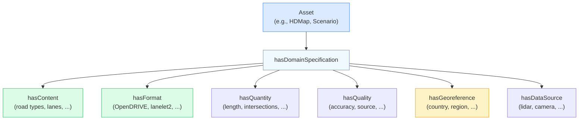
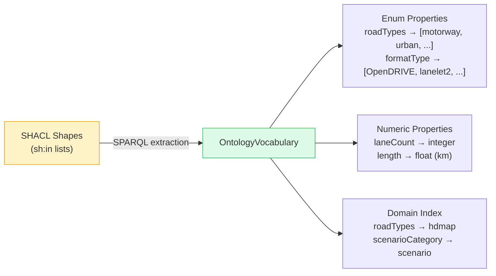
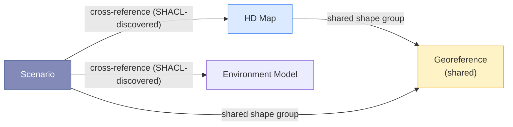

# Ontology Model

The system is **ontology-agnostic**: it works with any OWL + SHACL ontology and
discovers everything it needs at startup. The ENVITED-X simulation-asset
ontologies are the **demonstration** ontology used throughout these docs as the
running example — no production code path is specific to them (see
[Generic Design](/generic-design)).

## What is an Ontology?

In this context, an **ontology** is a formal description of the types, properties, and relationships of the assets being searched. It defines:

- **What types of assets exist** (in the demo: HD maps, scenarios, environment models, …)
- **What properties they have** (road types, lane counts, formats, countries, …)
- **What values are allowed** (e.g. road types must be one of: motorway, urban, rural, …)
- **How they relate to each other** (e.g. a scenario references an HD map)

An ontology in this system uses two W3C standards:

| Standard                               | Role                             | What it defines (demo example)                                          |
| -------------------------------------- | -------------------------------- | ----------------------------------------------------------------------- |
| **OWL** (Web Ontology Language)        | Class and property definitions   | "An HdMap has properties roadTypes, laneCount, formatType"              |
| **SHACL** (Shapes Constraint Language) | Value constraints and validation | "roadTypes must be one of: motorway, urban, rural, interstate, highway" |

## Domain Structure

The system does not assume any particular asset structure — it walks whatever
SHACL property paths the loaded ontology declares. The demo ENVITED-X ontologies
happen to give each asset type its own **domain ontology** following a consistent
pattern (shown below); a different ontology with a flatter or deeper shape would
work without code changes:



In the demo ontology this pattern is uniform across all domains, but uniformity is not required — the system discovers properties and values automatically from the SHACL shapes regardless of how they are organized.

## Vocabulary Extraction

The system does **not** use a manually maintained vocabulary. Instead, at startup:



### Example: How `sh:in` becomes vocabulary

The ontology defines allowed road types like this:

```turtle
hdmap:RoadTypesPropertyShape a sh:PropertyShape ;
  sh:path hdmap:roadTypes ;
  sh:in ("motorway" "urban" "rural" "interstate" "highway"
         "country-road" "pedestrian" "bicycle" "parking" "ramp") .
```

The vocabulary extractor runs a SPARQL query against the schema graph:

```sparql
SELECT ?property ?value ?domain WHERE {
  GRAPH <urn:graph:schema> {
    ?shape sh:path ?property ;
           sh:in/rdf:rest*/rdf:first ?value .
    ?parentShape sh:property ?shape .
  }
}
```

This produces a structured `OntologyVocabulary` that the prompt builder and slot validator consume — **fully automatically, no manual mapping required**.

### Why not SKOS?

An earlier design used manually maintained SKOS vocabularies as an intermediate layer. This was replaced because:

| SKOS approach                              | Direct OWL+SHACL approach               |
| ------------------------------------------ | --------------------------------------- |
| Manual maintenance per ontology change     | Automatic extraction at startup         |
| Risk of vocabulary drift                   | Always in sync with ontology            |
| Concept matcher with fuzzy string matching | LLM handles synonym resolution natively |
| Extra layer of indirection                 | Simpler, fewer moving parts             |

## Supported Domains

With the demo ENVITED-X ontologies loaded, the registry discovers **~20 domains** from the ontology source, of which **5 populated domains** carry sample instance data — **358 assets** in total:

| Domain                | Instance Assets | Key Properties                                                          |
| --------------------- | :-------------: | ----------------------------------------------------------------------- |
| **HD Map**            |       165       | roadTypes, laneCount, speedLimit, formatType, country, trafficDirection |
| **Environment Model** |       70        | terrainType, vegetationType, weatherCondition                           |
| **OSI Trace**         |       53        | roadTypes, granularity, fileFormat, numberFrames                        |
| **Scenario**          |       50        | scenarioCategory, weather, timeOfDay, trafficDensity                    |
| **Surface Model**     |       20        | materialType, frictionCoefficient, textureFormat                        |

Exact counts track the sample TTL files and may shift as they evolve. The remaining discovered domains ship SHACL shapes without sample instances (for example automotive-simulator, simulation-model, openlabel, simulated-sensor, and vv-report).

## Cross-Domain Relationships

Domains reference each other through SHACL property paths. The compiler discovers these cross-references at runtime — no predicate name is hardcoded in production code:



At warmup, `reference-index.ts` BFSes every typed asset instance and records each outgoing reference as a `(sourceClass, predicatePath, targetClass)` signature. The compiler uses these signatures to emit JOINs, and the per-row traceability breadcrumb under each result renders the actual predicate path that connected the two assets.

When a user searches for "scenarios on German motorways", the compiler generates a SPARQL query that joins scenario assets with their referenced HD map's georeference shape group. Broader queries can stay multi-domain as well: because `roadTypes` exists in both HD map and OSI trace ontologies, a search like "German motorway assets" can match both domains without hardcoded domain tables.
