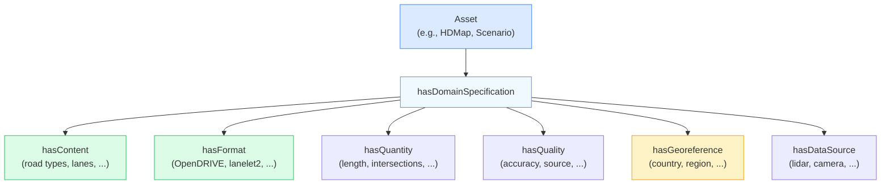
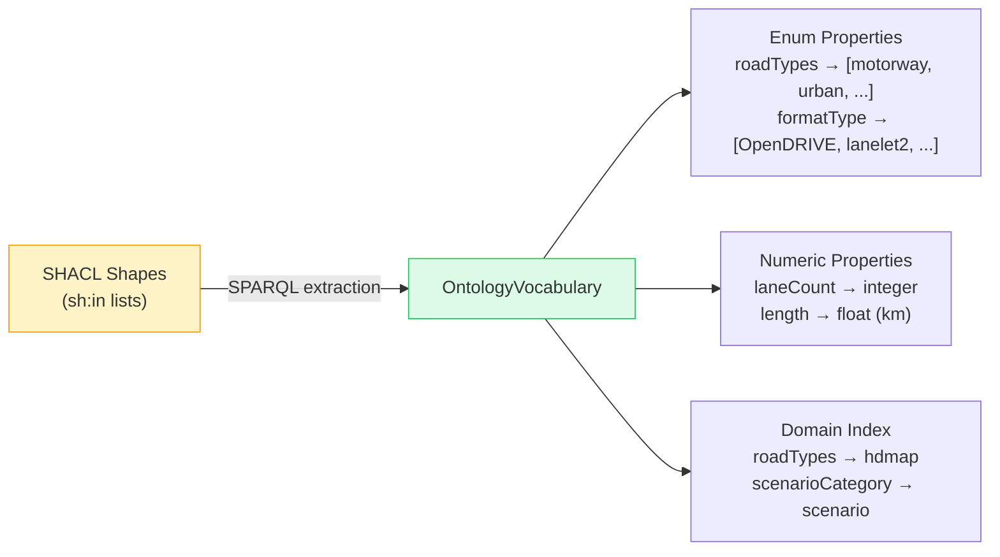
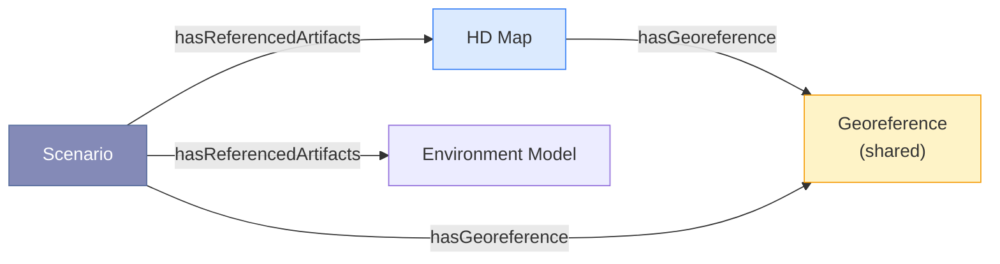

# Ontology Model

ENVITED-X: A modular ontology ecosystem for simulation asset metadata.

## What is an Ontology?

In this context, an **ontology** is a formal description of the types, properties, and relationships of simulation assets. It defines:

- **What types of assets exist** (HD maps, scenarios, environment models, ...)
- **What properties they have** (road types, lane counts, formats, countries, ...)
- **What values are allowed** (road types must be one of: motorway, urban, rural, ...)
- **How they relate to each other** (a scenario references an HD map)

The ENVITED-X ontologies use two W3C standards:

| Standard                               | Role                             | What it defines                                                         |
| -------------------------------------- | -------------------------------- | ----------------------------------------------------------------------- |
| **OWL** (Web Ontology Language)        | Class and property definitions   | "An HDMap has properties roadTypes, laneCount, formatType"              |
| **SHACL** (Shapes Constraint Language) | Value constraints and validation | "roadTypes must be one of: motorway, urban, rural, interstate, highway" |

## Domain Structure

Each simulation asset type has its own **domain ontology** following a consistent pattern:



This pattern is uniform across all domains — the system discovers properties and values automatically from the SHACL shapes.

## Vocabulary Extraction

The system does **not** use a manually maintained vocabulary. Instead, at startup:



### Example: How `sh:in` becomes vocabulary

The ontology defines allowed road types like this:

```turtle
hdmap:RoadTypesPropertyShape a sh:PropertyShape ;
  sh:path hdmap:roadTypes ;
  sh:in ("motorway" "urban" "rural" "interstate" "highway"
         "country-road" "pedestrian" "bicycle" "parking" "ramp") .
```

The vocabulary extractor runs a SPARQL query against the schema graph:

```sparql
SELECT ?property ?value ?domain WHERE {
  GRAPH <urn:graph:schema> {
    ?shape sh:path ?property ;
           sh:in/rdf:rest*/rdf:first ?value .
    ?parentShape sh:property ?shape .
  }
}
```

This produces a structured `OntologyVocabulary` that the prompt builder and slot validator consume — **fully automatically, no manual mapping required**.

### Why not SKOS?

An earlier design used manually maintained SKOS vocabularies as an intermediate layer. This was replaced because:

| SKOS approach                              | Direct OWL+SHACL approach               |
| ------------------------------------------ | --------------------------------------- |
| Manual maintenance per ontology change     | Automatic extraction at startup         |
| Risk of vocabulary drift                   | Always in sync with ontology            |
| Concept matcher with fuzzy string matching | LLM handles synonym resolution natively |
| Extra layer of indirection                 | Simpler, fewer moving parts             |

## Supported Domains

The system auto-discovers **22 ontology domains** from the ontology source. Currently, **5 domains** have sample instance data:

| Domain                | Instance Assets | Key Properties                                                          |
| --------------------- | :-------------: | ----------------------------------------------------------------------- |
| **HD Map**            |       117       | roadTypes, laneCount, speedLimit, formatType, country, trafficDirection |
| **Scenario**          |       50        | scenarioCategory, weather, timeOfDay, trafficDensity                    |
| **OSI Trace**         |       50        | roadTypes, granularity, fileFormat, numberFrames                        |
| **Environment Model** |       30        | terrainType, vegetationType, weatherCondition                           |
| **Surface Model**     |       20        | materialType, frictionCoefficient, textureFormat                        |

Additional ontology-only domains are still discovered at startup (for example automotive-simulator, simulation-model, openlabel, simulated-sensor, and vv-report).

## Cross-Domain Relationships

Domains can reference each other. The compiler handles these cross-domain joins:



When a user searches for "scenarios on German motorways", the compiler generates a SPARQL query that joins scenario assets with their referenced HD map's georeference properties. Broader queries can stay multi-domain as well: because `roadTypes` exists in both HD map and OSI trace ontologies, a search like "German motorway assets" can match both domains without hardcoded domain tables.
