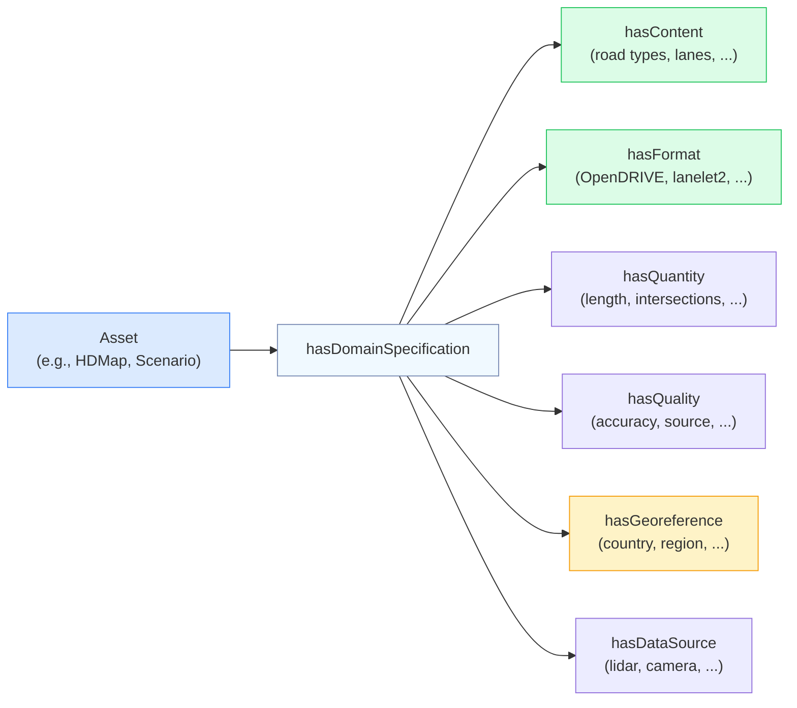
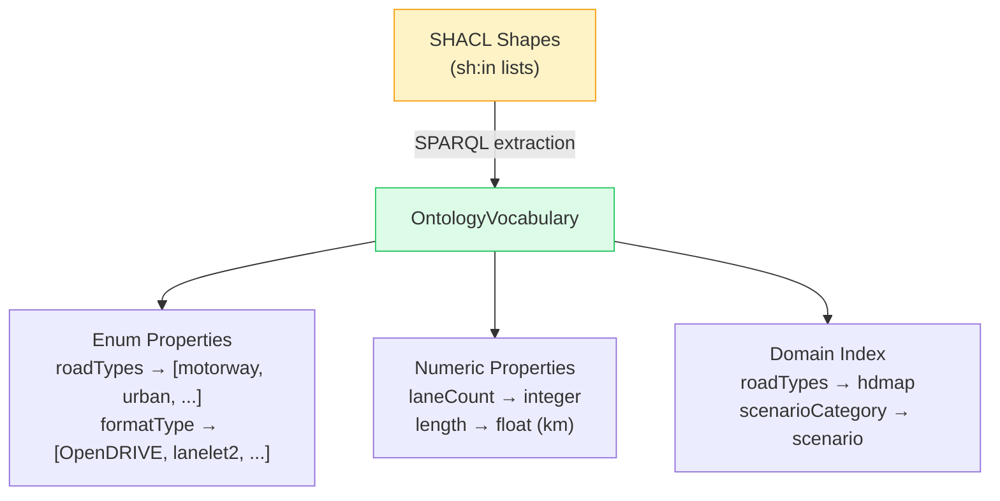
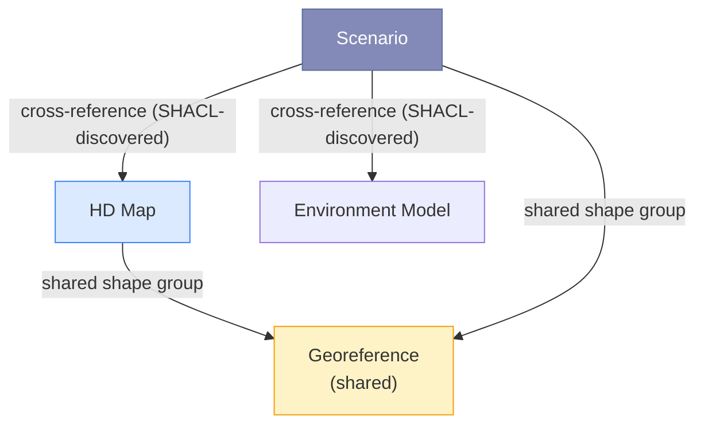

# Ontology Model

The system is **ontology-agnostic**: it works with any OWL + SHACL ontology and
discovers everything it needs at startup. The ENVITED-X simulation-asset
ontologies are the **demonstration** ontology used throughout these docs as the
running example — no production code path is specific to them (see
[Generic Design](/generic-design)).

## What is an Ontology?

In this context, an **ontology** is a formal description of the types, properties, and relationships of the assets being searched. It defines:

- **What types of assets exist** (in the demo: HD maps, scenarios, environment models, …)
- **What properties they have** (road types, lane counts, formats, countries, …)
- **What values are allowed** (e.g. road types must be one of: motorway, urban, rural, …)
- **How they relate to each other** (e.g. a scenario references an HD map)

An ontology in this system uses two W3C standards:

| Standard                               | Role                             | What it defines (demo example)                                          |
| -------------------------------------- | -------------------------------- | ----------------------------------------------------------------------- |
| **OWL** (Web Ontology Language)        | Class and property definitions   | "An HdMap has properties roadTypes, laneCount, formatType"              |
| **SHACL** (Shapes Constraint Language) | Value constraints and validation | "roadTypes must be one of: motorway, urban, rural, interstate, highway" |

## Domain Structure

The system does not assume any particular asset structure — it walks whatever
SHACL property paths the loaded ontology declares. The demo ENVITED-X ontologies
happen to give each asset type its own **domain ontology** following a consistent
pattern (shown below); a different ontology with a flatter or deeper shape would
work without code changes:


```mermaid
graph LR
    A["Asset<br/>(e.g., HDMap, Scenario)"] --> DS["hasDomainSpecification"]
    DS --> C["hasContent<br/>(road types, lanes, ...)"]
    DS --> F["hasFormat<br/>(OpenDRIVE, lanelet2, ...)"]
    DS --> Q["hasQuantity<br/>(length, intersections, ...)"]
    DS --> QL["hasQuality<br/>(accuracy, source, ...)"]
    DS --> GR["hasGeoreference<br/>(country, region, ...)"]
    DS --> DT["hasDataSource<br/>(lidar, camera, ...)"]

    style A fill:#dbeafe,stroke:#3b82f6
    style DS fill:#f0f9ff,stroke:#798bb3
    style C fill:#dcfce7,stroke:#22c55e
    style F fill:#dcfce7,stroke:#22c55e
    style GR fill:#fef3c7,stroke:#f59e0b
```

In the demo ontology this pattern is uniform across all domains, but uniformity is not required — the system discovers properties and values automatically from the SHACL shapes regardless of how they are organized.

## Vocabulary Extraction

The system does **not** use a manually maintained vocabulary. Instead, at startup:


```mermaid
graph TD
    SHACL["SHACL Shapes<br/>(sh:in lists)"] -->|"SPARQL extraction"| VOCAB["OntologyVocabulary"]
    VOCAB --> ENUM["Enum Properties<br/>roadTypes → [motorway, urban, ...]<br/>formatType → [OpenDRIVE, lanelet2, ...]"]
    VOCAB --> NUM["Numeric Properties<br/>laneCount → integer<br/>length → float (km)"]
    VOCAB --> DOM["Domain Index<br/>roadTypes → hdmap<br/>scenarioCategory → scenario"]

    style SHACL fill:#fef3c7,stroke:#f59e0b
    style VOCAB fill:#dcfce7,stroke:#22c55e
```

### Example: How `sh:in` becomes vocabulary

The ontology defines allowed road types like this:

```turtle
hdmap:RoadTypesPropertyShape a sh:PropertyShape ;
  sh:path hdmap:roadTypes ;
  sh:in ("motorway" "urban" "rural" "interstate" "highway"
         "country-road" "pedestrian" "bicycle" "parking" "ramp") .
```

The vocabulary extractor runs a SPARQL query against the schema graph:

```sparql
SELECT ?property ?value ?domain WHERE {
  GRAPH <urn:graph:schema> {
    ?shape sh:path ?property ;
           sh:in/rdf:rest*/rdf:first ?value .
    ?parentShape sh:property ?shape .
  }
}
```

This produces a structured `OntologyVocabulary` that the prompt builder and slot validator consume — **fully automatically, no manual mapping required**.

### Why not SKOS?

An earlier design used manually maintained SKOS vocabularies as an intermediate layer. This was replaced because:

| SKOS approach                              | Direct OWL+SHACL approach               |
| ------------------------------------------ | --------------------------------------- |
| Manual maintenance per ontology change     | Automatic extraction at startup         |
| Risk of vocabulary drift                   | Always in sync with ontology            |
| Concept matcher with fuzzy string matching | LLM handles synonym resolution natively |
| Extra layer of indirection                 | Simpler, fewer moving parts             |

## Supported Domains

With the demo ENVITED-X ontologies loaded, the registry discovers **~20 domains** from the ontology source, of which **5 populated domains** carry sample instance data — **358 assets** in total:

| Domain                | Instance Assets | Key Properties                                                          |
| --------------------- | :-------------: | ----------------------------------------------------------------------- |
| **HD Map**            |       165       | roadTypes, laneCount, speedLimit, formatType, country, trafficDirection |
| **Environment Model** |       70        | terrainType, vegetationType, weatherCondition                           |
| **OSI Trace**         |       53        | roadTypes, granularity, fileFormat, numberFrames                        |
| **Scenario**          |       50        | scenarioCategory, weather, timeOfDay, trafficDensity                    |
| **Surface Model**     |       20        | materialType, frictionCoefficient, textureFormat                        |

Exact counts track the sample TTL files and may shift as they evolve. The remaining discovered domains ship SHACL shapes without sample instances (for example automotive-simulator, simulation-model, openlabel, simulated-sensor, and vv-report).

## Cross-Domain Relationships

Domains reference each other through SHACL property paths. The compiler discovers these cross-references at runtime — no predicate name is hardcoded in production code:


```mermaid
graph TD
    SC["Scenario"] -->|"cross-reference (SHACL-discovered)"| HD["HD Map"]
    SC -->|"cross-reference (SHACL-discovered)"| EM["Environment Model"]
    HD -->|"shared shape group"| GEO["Georeference<br/>(shared)"]
    SC -->|"shared shape group"| GEO

    style SC fill:#848ab7,stroke:#5a6f9f,color:#fff
    style HD fill:#dbeafe,stroke:#3b82f6
    style GEO fill:#fef3c7,stroke:#f59e0b
```

At warmup, `reference-index.ts` BFSes every typed asset instance and records each outgoing reference as a `(sourceClass, predicatePath, targetClass)` signature. The compiler uses these signatures to emit JOINs, and the per-row traceability breadcrumb under each result renders the actual predicate path that connected the two assets.

When a user searches for "scenarios on German motorways", the compiler generates a SPARQL query that joins scenario assets with their referenced HD map's georeference shape group. Broader queries can stay multi-domain as well: because `roadTypes` exists in both HD map and OSI trace ontologies, a search like "German motorway assets" can match both domains without hardcoded domain tables.

## Ontology Sources & the `imports/` Opt-In

The stack loads its artifacts from the roots declared in `ontology-sources.json`
(validated by `ontology-sources.schema.json`, JSON Schema 2020-12), or in the
manifest `ONTOLOGY_SOURCES_FILE` points at. Without a manifest it falls back to
`ONTOLOGY_ARTIFACTS_PATH`, then to the pinned `.ontology/artifacts` cache.
Multiple roots are supported, each with an optional per-root `domains` allowlist.

OMB also ships `imports/` — the foundation vocabularies its ontologies build on
(`cred`, `cs`, `dcterms`, `did`, `foaf`, `org`, `owl`, `prov`, `rdf`, `rdfs`,
`schema`, `sec`, `sh`, `skos`, `xsd` as per-directory `*.owl.ttl`). These are
**not loaded by default**, and measurement shows loading them is safe but buys
nothing for search today:

| metric                        | artifacts only | + `imports/` |
| ----------------------------- | -------------- | ------------ |
| schema-graph triples          | 248,135        | 272,287      |
| term cards / searchable props | 483 / 165      | 483 / 165    |
| asset domains / ref. edges    | 13 / 469       | 13 / 469     |
| retrieval recall (gating set) | 1.00           | 1.00         |

Searchable vocabulary is SHACL-driven and `imports/` ships no `*.shacl.ttl`,
so no phantom domains or meta-vocabulary properties can appear — no filter
layer is required. The only growth is foundation `rdfs:subClassOf` edges,
which nothing on the search path consumes yet.

**To opt in** (e.g. when foundation class hierarchies become load-bearing),
add a second source to `ontology-sources.json`:

```json
{
  "sources": [
    { "name": "omb-artifacts", "path": ".ontology/artifacts" },
    { "name": "omb-imports", "path": ".ontology/imports" }
  ]
}
```

No code change is involved; the loader, term index, retrieval, and compiler
are root-agnostic by construction. `OpenDrive`/`OpenScenario` under `imports/`
contain only XSD schemas (no RDF) and cannot be loaded.

## Using your own ontology

Any OWL + SHACL ontology can replace the demo one, including a private one
that must not be referenced from this repository. Nothing about it is
committed here: the manifest, artifacts and instance data all live next to
your ontology, and a single git-ignored setting points the stack at them.

### Prerequisites

- **Artifacts in the per-domain layout** the loader discovers:
  `<root>/<domain>/<domain>.shacl.ttl`, plus optional `<domain>.owl.ttl` and
  `<domain>.context.jsonld`. Tools that generate an
  [OMB](https://github.com/ASCS-eV/ontology-management-base)-style bundle
  (e.g. LinkML `gen-owl` / `gen-shacl` / `gen-jsonld-context` per module)
  produce exactly this.
- **SHACL node shapes** with `sh:targetClass` in the domain's namespace; nested
  structure via `sh:node` or `sh:class`; enumerations via `sh:in`. The
  searchable vocabulary is derived from these shapes alone.
- **Instance data** (JSON-LD or Turtle) whose asset nodes are typed with the
  root class. `rdfs:label` is used as the display name when present; it is not
  required (closed shapes cannot carry it).

### Configure

1. Write a manifest next to your ontology checkout. Relative paths resolve
   against the manifest's own directory; absolute paths are used as-is.

   ```json
   {
     "sources": [
       {
         "name": "my-asset",
         "path": "build/artifacts",
         "domains": ["module-a", "module-b"],
         "data": "examples/search-data"
       }
     ]
   }
   ```

   - `domains` — list the per-module bundles and leave out an umbrella bundle
     that re-declares every module's shapes, or those shapes load twice.
   - `data` — once any source declares it, the built-in demo data is not
     loaded. A source's `name` is promoted to a searchable asset domain.

2. Point the stack at it in `.env.local` (git-ignored):

   ```bash
   ONTOLOGY_SOURCES_FILE=../my-ontology/ontology-sources.json
   ```

3. Verify and start:

   ```bash
   pnpm run check:setup     # counts the shape files the manifest resolves to
   pnpm run build && pnpm run --filter @ontology-search/api start
   curl localhost:3003/stats        # asset counts per discovered domain
   curl localhost:3003/vocabulary   # searchable properties + sh:in values
   ```

The pinned OMB distribution is still fetched on `pnpm install`; the authoring
features use its `imports/`, search does not.

### Instance data notes

- **Remote `@context`.** A context IRI is resolved offline against the
  `*.context.jsonld` files of the source's `path`, matched by their `@vocab`
  / `@base`. The catalog form `<ontology-iri>/context` (or `#context`) matches
  the context whose `@vocab` is `<ontology-iri>/`.
- **Relative IRIs** in schema Turtle files resolve against the file location
  ([TURTLE] §6.3), so generator output without `@base` still loads.
- **Validate before loading.** OMB's suite checks data against the same
  bundle:

  ```bash
  python -m omb.validators.validation_suite --run check-data-conformance \
    --data-paths <data-dir> --artifacts <artifacts-root> --inference-mode rdfs
  ```

  Give nested objects an explicit `@type` when their properties carry no
  `rdfs:range` in the OWL (class-scoped attributes), and type literals whose
  term has no datatype coercion in the context
  (`{"@value": "120.0", "@type": "xsd:float"}`), or RDFS inference cannot type
  them and `sh:class` / `sh:datatype` constraints fail.

### Known limitation: value-object wrappers

Filters are keyed by a property's local name. Ontologies that wrap many
categorical properties in value objects sharing one leaf property (e.g.
`colour → ColourValue → value`, `size → SizeValue → value`) expose all of them as
a single `value` leaf with a merged `sh:in`, and the compiler resolves it to
one path. Properties that carry their enumeration directly are searchable;
wrapped ones currently surface as gaps. Resolving the leaf per path by its own
`sh:in` is the follow-up.
