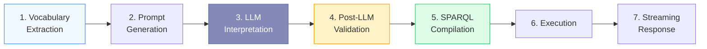
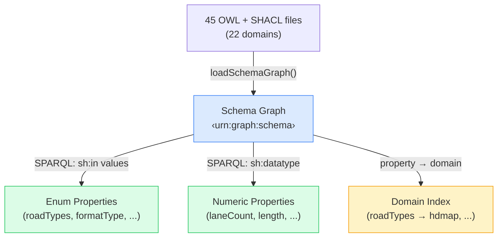
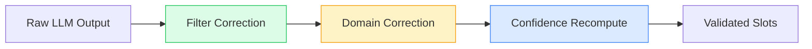

# Query Flow

From "motorway maps in Germany" to SPARQL results — step by step.

## Pipeline Stages



## Stage 1: Vocabulary Extraction (startup)

At startup, the **schema loader** reads 45 OWL + SHACL files from 22 domains into a named graph (`<urn:graph:schema>`). The **vocabulary extractor** then runs SPARQL queries to build a structured vocabulary:



**Output:** `OntologyVocabulary` containing `enumProperties[]` and `numericProperties[]`, each with their domain association.

## Stage 2: Prompt Generation

The **prompt builder** converts the extracted vocabulary into a structured LLM system prompt:

- Markdown tables of allowed values per domain (e.g., `roadTypes: motorway, urban, rural, ...`)
- Numeric property descriptions with ranges
- Location and license field instructions
- Few-shot examples with expected `submit_slots` tool-call output

The prompt is generated once at startup and cached. When the ontology changes, the prompt updates automatically.

## Stage 3: LLM Interpretation

The LLM agent receives the user query + generated prompt and calls the `submit_slots` tool:

```json
{
  "slots": {
    "domains": ["hdmap"],
    "filters": { "roadTypes": "motorway", "country": "DE" },
    "ranges": { "laneCount": { "min": 3 } }
  },
  "interpretation": "German motorways with at least 3 lanes",
  "gaps": [{ "term": "ADAS testing", "reason": "Not a defined ontology property" }]
}
```

The LLM is the **natural-language synonym resolver** — "highway" → "motorway", "German" → "DE", "Autobahn" → "motorway" are all natural language inferences grounded by the vocabulary tables in the prompt.

## Stage 4: Post-LLM Validation

The **slot validator** applies three corrections to catch LLM mistakes:



| Correction                   | What it does                                     | Example                                                             |
| ---------------------------- | ------------------------------------------------ | ------------------------------------------------------------------- |
| **Filter correction**        | Fuzzy-matches values against `sh:in` vocabulary  | `"Motorway"` → `"motorway"`, `"hihgway"` → `"highway"`              |
| **Domain correction**        | Fixes wrong domain when filters belong elsewhere | LLM chose `scenario` but `roadTypes` is hdmap → corrects to `hdmap` |
| **Confidence recomputation** | Removes LLM bias from confidence scores          | Exact `sh:in` match = high, edit-distance match = medium            |
| **Gap enrichment**           | Adds suggestions from real vocabulary for gaps   | `"ADAS testing"` → suggests `"free-driving"`, `"following"`         |

## Stage 5: SPARQL Compilation

The compiler takes validated `SearchSlots` and produces deterministic SPARQL:

```sparql
PREFIX rdfs: <http://www.w3.org/2000/01/rdf-schema#>
PREFIX hdmap: <https://w3id.org/ascs-ev/envited-x/hdmap/v5/>
PREFIX geo: <https://w3id.org/ascs-ev/envited-x/georeference/v5/>
PREFIX manifest: <https://w3id.org/ascs-ev/envited-x/manifest/v5/>

SELECT ?asset ?name ?roadTypes ?country WHERE {
  ?asset a manifest:HDMap ;
    rdfs:label ?name .
  ?asset manifest:hasDomainSpecification ?ds .
  ?ds hdmap:hasContent ?content .
  ?content hdmap:roadTypes ?roadTypes .
  ?ds hdmap:hasGeoreference ?geo .
  ?geo geo:hasProjectLocation ?loc .
  ?loc geo:country ?country .
  FILTER(?roadTypes = "motorway")
  FILTER(CONTAINS(LCASE(?country), "de"))
}
LIMIT 100
```

**Key properties:**

- ✅ **Deterministic** — same input always produces the same query
- ✅ **Validated** — only uses known properties and allowed values
- ✅ **Cross-domain** — scenario queries can reference HD map properties

## Stage 6: Execution

SPARQL runs against the in-memory **Oxigraph** store:

- Pre-loaded with 167 instance assets (117 HD maps + 50 scenarios)
- Schema graph separate from instance data (`<urn:graph:schema>` vs default graph)
- Sub-millisecond query execution for most queries

## Stage 7: Streaming Response

Results are sent as **Server-Sent Events** (SSE) — the UI updates progressively:

| Event            | Payload                           | When                       |
| ---------------- | --------------------------------- | -------------------------- |
| `status`         | `{ phase: "interpreting" }`       | Pipeline starts            |
| `interpretation` | `{ summary, mappedTerms[] }`      | LLM interpretation ready   |
| `gaps`           | `[{ term, reason, suggestions }]` | Unmatched terms identified |
| `sparql`         | `"SELECT ..."`                    | Query compiled             |
| `status`         | `{ phase: "executing" }`          | Execution starts           |
| `results`        | `{ results: [...] }`              | Query results              |
| `meta`           | `{ matchCount, executionTimeMs }` | Timing stats               |
| `done`           | `{}`                              | Pipeline complete          |

Users see the interpretation immediately while SPARQL execution happens in the background — perceived latency is dramatically reduced.
