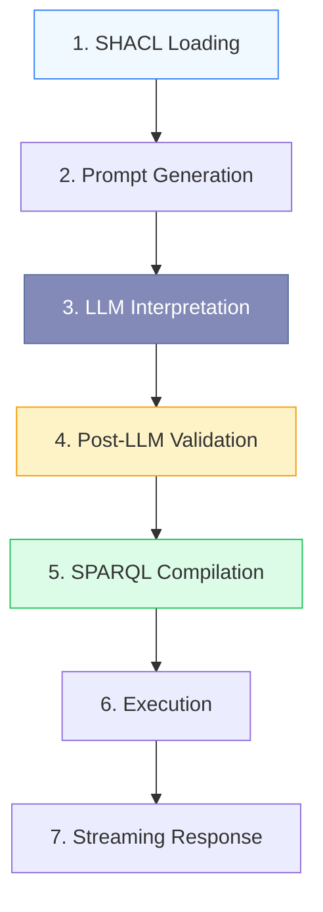
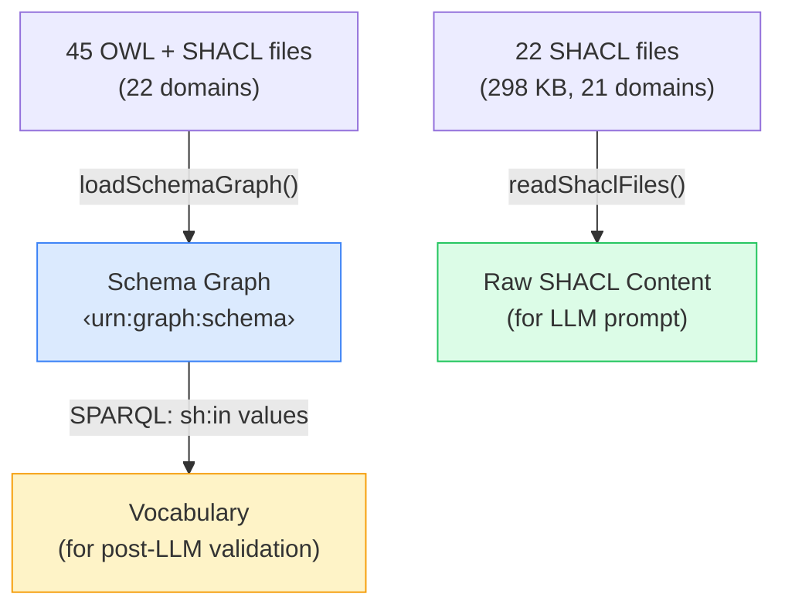
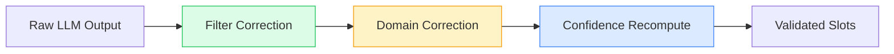

# Query Flow

From "motorway maps in Germany" to SPARQL results — step by step.

## Pipeline Stages



## Stage 1: SHACL Loading (startup)

At startup, the **schema loader** reads 45 OWL + SHACL files from 22 domains into a named graph (`<urn:graph:schema>`). In parallel, the **SHACL reader** reads the raw `.shacl.ttl` file content (22 files, ~298 KB from 21 domains — `gx` excluded at 2.3 MB):



**Output:** Raw SHACL Turtle content for prompt injection + `OntologyVocabulary` for post-LLM validation.

## Stage 2: Prompt Generation

The **prompt builder** embeds the raw SHACL Turtle content directly into the system prompt, organized by domain:

- Raw Turtle shapes per domain in fenced code blocks (the LLM reads `sh:in`, `sh:pattern`, `sh:datatype`, `sh:description` natively)
- Location and license field instructions
- Synonym resolution rules ("YOU are the synonym resolver")
- Few-shot examples with expected `submit_slots` tool-call output

The prompt is generated once at startup and cached. When the ontology changes, the prompt updates automatically.

## Stage 3: LLM Interpretation

The LLM agent receives the user query + generated prompt and calls the `submit_slots` tool:

```json
{
  "slots": {
    "domains": ["hdmap"],
    "filters": { "roadTypes": "motorway", "country": "DE" },
    "ranges": { "laneCount": { "min": 3 } }
  },
  "interpretation": "German motorways with at least 3 lanes",
  "gaps": [{ "term": "ADAS testing", "reason": "Not a defined ontology property" }]
}
```

The LLM is the **natural-language synonym resolver** — "highway" → "motorway", "German" → "DE", "Autobahn" → "motorway" are all natural language inferences grounded by the raw SHACL shapes in the prompt. The LLM reads `sh:in` enumerations, `sh:pattern` constraints, and `sh:description` annotations directly from the Turtle content.

## Stage 4: Post-LLM Validation

The **slot validator** applies three corrections to catch LLM mistakes:



| Correction                   | What it does                                                                          | Example                                                                   |
| ---------------------------- | ------------------------------------------------------------------------------------- | ------------------------------------------------------------------------- |
| **Filter correction**        | Fuzzy-matches values against `sh:in` vocabulary                                       | `"Motorway"` → `"motorway"`, `"hihgway"` → `"highway"`                    |
| **Domain correction**        | Uses a property → `Set<domain>` map to preserve valid choices and add missing domains | LLM chose `["scenario"]` for "scenarios on motorways" → merges in `hdmap` |
| **Confidence recomputation** | Removes LLM bias from confidence scores                                               | Exact `sh:in` match = high, edit-distance match = medium                  |
| **Gap enrichment**           | Adds suggestions from real vocabulary for gaps                                        | `"ADAS testing"` → suggests `"free-driving"`, `"following"`               |

## Stage 5: SPARQL Compilation

The compiler first queries the schema graph via `schema-queries.ts` to build `CompilerVocab` (`properties`, `shapeGroups`, `range2DProperties`), discover asset domains, and resolve cross-domain references. It then turns validated `SearchSlots` into deterministic SPARQL:

```sparql
PREFIX rdfs: <http://www.w3.org/2000/01/rdf-schema#>
PREFIX hdmap: <https://w3id.org/ascs-ev/envited-x/hdmap/v6/>
PREFIX georeference: <https://w3id.org/ascs-ev/envited-x/georeference/v5/>

SELECT ?asset ?name ?roadTypes ?country WHERE {
  ?asset a hdmap:HdMap ;
    rdfs:label ?name ;
    hdmap:hasDomainSpecification ?ds .
  ?ds hdmap:hasContent ?content .
  ?content hdmap:roadTypes ?roadTypes .
  ?ds hdmap:hasGeoreference ?georef .
  ?georef georeference:hasProjectLocation ?loc .
  ?loc georeference:country ?country .
  FILTER(?roadTypes = "motorway")
  FILTER(?country = "DE")
}
LIMIT 100
```

**Key properties:**

- ✅ **Deterministic** — same input always produces the same query
- ✅ **Validated** — only uses known properties and allowed values
- ✅ **Cross-domain** — scenario queries can reference HD map properties

## Stage 6: Execution

SPARQL runs against the in-memory **Oxigraph** store:

- Pre-loaded with 267 instance assets (117 HD maps + 50 scenarios + 50 OSI traces + 30 environment models + 20 surface models)
- Schema graph separate from instance data (`<urn:graph:schema>` vs default graph)
- Sub-millisecond query execution for most queries

## Stage 7: Streaming Response

Results are sent as **Server-Sent Events** (SSE) — the UI updates progressively:

| Event            | Payload                           | When                       |
| ---------------- | --------------------------------- | -------------------------- |
| `status`         | `{ phase: "interpreting" }`       | Pipeline starts            |
| `interpretation` | `{ summary, mappedTerms[] }`      | LLM interpretation ready   |
| `gaps`           | `[{ term, reason, suggestions }]` | Unmatched terms identified |
| `sparql`         | `"SELECT ..."`                    | Query compiled             |
| `status`         | `{ phase: "executing" }`          | Execution starts           |
| `results`        | `{ results: [...] }`              | Query results              |
| `meta`           | `{ matchCount, executionTimeMs }` | Timing stats               |
| `done`           | `{}`                              | Pipeline complete          |

Users see the interpretation immediately while SPARQL execution happens in the background — perceived latency is dramatically reduced.
