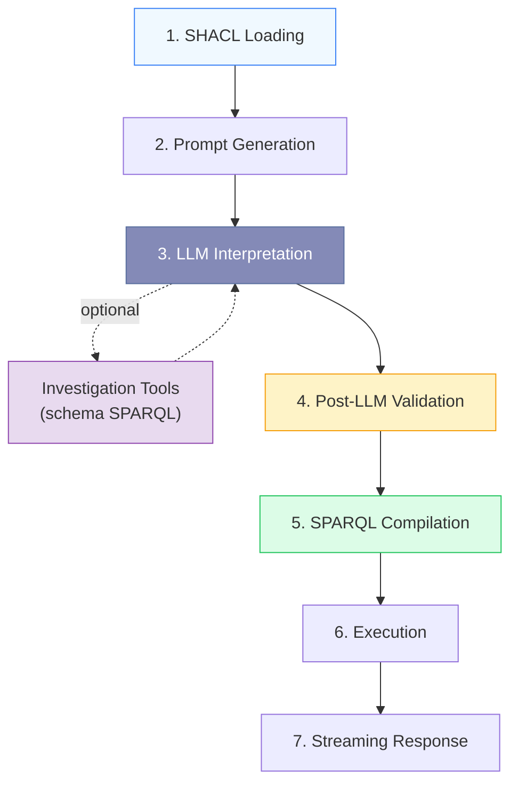
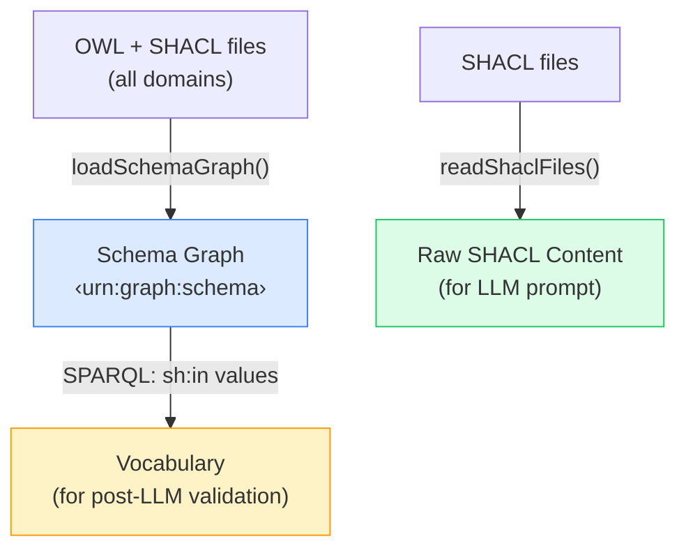
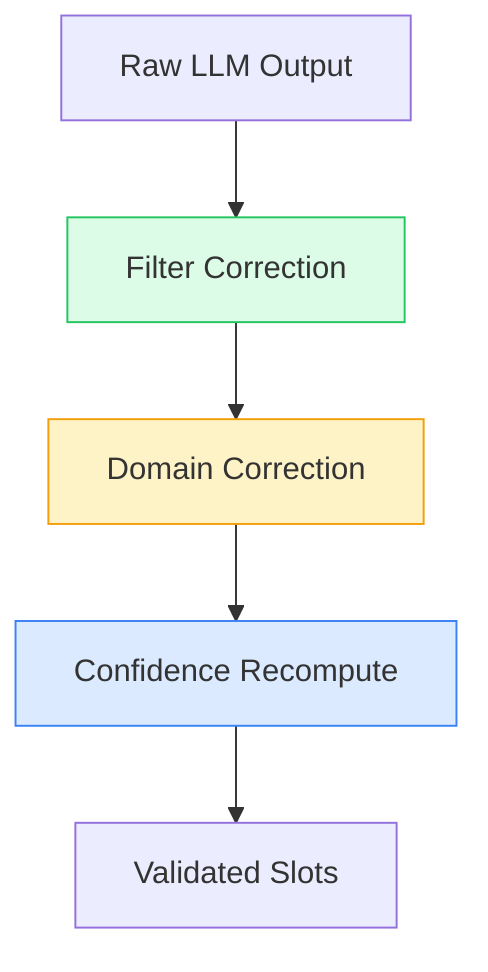

# Query Flow

From "motorway maps in Germany" to SPARQL results — step by step.

## Pipeline Stages



## Stage 1: SHACL Loading (startup)

At startup, the **schema loader** reads all OWL + SHACL files into a named graph (`<urn:graph:schema>`). In parallel, the **SHACL reader** extracts raw `.shacl.ttl` content for the LLM prompt:



**Output:** Raw SHACL Turtle for prompt injection + `OntologyVocabulary` for validation + schema graph for compiler queries.

## Stage 2: Prompt Generation

The **prompt builder** embeds the raw SHACL Turtle content directly into the system prompt, organized by domain:

- Raw Turtle shapes per domain in fenced code blocks (the LLM reads `sh:in`, `sh:pattern`, `sh:datatype`, `sh:description` natively)
- Guidance for geography and license filters (kept in the generic `filters` map, not as dedicated slots)
- Synonym resolution rules ("YOU are the synonym resolver")
- Few-shot examples with expected `submit_slots` tool-call output

The prompt is generated once at startup and cached. When the ontology changes, the prompt updates automatically.

## Stage 3: LLM Interpretation

The LLM agent receives the user query + generated prompt and calls `submit_slots`:

```json
{
  "slots": {
    "domains": ["hdmap"],
    "filters": { "roadTypes": ["motorway"], "country": ["DE"] },
    "ranges": { "laneCount": { "min": 3 } },
    "references": [{ "domain": "ositrace" }]
  },
  "interpretation": "German motorway HD maps with at least 3 lanes; cross-referenced to OSI traces",
  "gaps": [{ "term": "ADAS testing", "reason": "Not a defined ontology property" }]
}
```

The LLM resolves natural-language synonyms ("highway" → "motorway", "German" → "DE") grounded by the raw SHACL shapes. There are no top-level `location` or `license` slots: country, region, city and license all flow through the same `filters` map, keyed by SHACL leaf local name. The optional `references` slot is a **list** of cross-domain JOINs, each bound to a SHACL-discovered asset class; they are AND-combined, so an asset must reference _all_ listed domains to match. Each entry may itself nest `references` to express a **chain** (scenario → trace → map) rather than flat siblings (scenario → trace AND scenario → map). A single object is still accepted and normalized to a one-element list for backward compatibility.

The agent is configured with `toolChoice: { type: 'tool', toolName: 'submit_slots' }` — the LLM commits on step 1. Investigation tools remain available but are rarely needed because the full SHACL is already in the prompt.

## Stage 4: Post-LLM Validation

The **slot validator** applies three corrections to catch LLM mistakes:



| Correction                   | What it does                                                                          | Example                                                                   |
| ---------------------------- | ------------------------------------------------------------------------------------- | ------------------------------------------------------------------------- |
| **Filter correction**        | Fuzzy-matches values against `sh:in` vocabulary                                       | `"Motorway"` → `"motorway"`, `"hihgway"` → `"highway"`                    |
| **Domain correction**        | Uses a property → `Set<domain>` map to preserve valid choices and add missing domains | LLM chose `["scenario"]` for "scenarios on motorways" → merges in `hdmap` |
| **Confidence recomputation** | Removes LLM bias from confidence scores                                               | Exact `sh:in` match = high, edit-distance match = medium                  |
| **Gap enrichment**           | Adds suggestions from real vocabulary for gaps                                        | `"ADAS testing"` → suggests `"free-driving"`, `"following"`               |

## Stage 5: SPARQL Compilation

The compiler uses **property paths** discovered from SHACL (not hardcoded predicates) and builds `CompilerVocab` from schema graph queries. It turns validated `SearchSlots` into deterministic SPARQL:

```sparql
PREFIX rdfs: <http://www.w3.org/2000/01/rdf-schema#>
PREFIX hdmap: <https://w3id.org/ascs-ev/envited-x/hdmap/v6/>
PREFIX georeference: <https://w3id.org/ascs-ev/envited-x/georeference/v5/>

SELECT ?asset ?name ?roadTypes ?country WHERE {
  ?asset a hdmap:HdMap ;
    rdfs:label ?name .
  ?asset hdmap:hasDomainSpecification ?domSpec .
  ?domSpec hdmap:hasContent ?content .
  ?content hdmap:roadTypes ?roadTypes .
  ?domSpec hdmap:hasGeoreference ?georef .
  ?georef georeference:hasProjectLocation ?loc .
  ?loc georeference:country ?country .
  FILTER(?roadTypes = "motorway")
  FILTER(CONTAINS(LCASE(STR(?country)), "de"))
}
LIMIT 100
```

**Key properties:**

- ✅ **Deterministic** — same slots always produce the same query
- ✅ **Ontology-agnostic** — predicate chains discovered from SHACL, not hardcoded
- ✅ **W3C-compliant** — `STR()` wrapping handles both literal and IRI-valued nodes
- ✅ **Cross-domain** — referenced domains only join when they carry active filters
- ✅ **Syntax-validated** — post-compilation validation catches structural errors

## Stage 6: Execution

SPARQL runs against the in-memory **Oxigraph** store:

- Instance data in the default graph; schema in `<urn:graph:schema>`
- Sub-millisecond query execution for most queries
- Supports both Oxigraph WASM (dev/test) and remote Fuseki (production)

## Stage 7: Streaming Response

Results are sent as **Server-Sent Events** (SSE) — the UI updates progressively:

| Event            | Payload                           | When                       |
| ---------------- | --------------------------------- | -------------------------- |
| `status`         | `{ phase: "interpreting" }`       | Pipeline starts            |
| `interpretation` | `{ summary, mappedTerms[] }`      | LLM interpretation ready   |
| `gaps`           | `[{ term, reason, suggestions }]` | Unmatched terms identified |
| `sparql`         | `"SELECT ..."`                    | Query compiled             |
| `status`         | `{ phase: "executing" }`          | Execution starts           |
| `results`        | `{ results: [...] }`              | Query results              |
| `meta`           | `{ matchCount, executionTimeMs }` | Timing stats               |
| `done`           | `{}`                              | Pipeline complete          |

`matchCount` is the number of **distinct primary assets**, not result rows — a cross-reference JOIN fans out to one row per referenced asset, so the UI groups rows by `?asset` and the count reflects assets (rows ≥ matches). When the query contains a reference JOIN, the `results` payload also carries a per-row, per-reference `traceability` breadcrumb.

Users see the interpretation immediately while SPARQL execution happens in the background — perceived latency is dramatically reduced.
