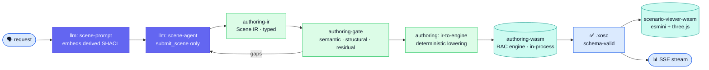
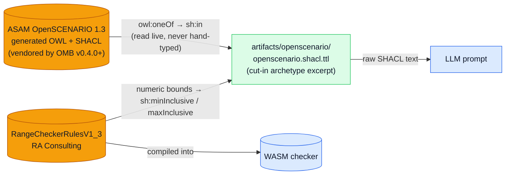

<SlideProvider :total-slides="12">
<SlideDeck>

<Slide :index="0" variant="title">
  
Scenario Authoring

  
The same architecture, run in reverse — from reading a data space to writing into it

  <h1>Natural-Language Scenario Authoring</h1>
  
Plain-language requests become schema-valid <strong>ASAM OpenSCENARIO</strong> <code>.xosc</code> files — the model fills a typed scene, a deterministic lowering emits the XML, and an in-process engine proves it conforms.

  

    

      <strong>0</strong>
      lines of model-written XML — the LLM fills a typed IR, a compiler emits the <code>.xosc</code>
    

    

      <strong>1</strong>
      derived translation dictionary — OWL + SHACL lifted from the ASAM standard, not hand-invented
    

    

      <strong>2</strong>
      in-process WASM engines — one authors and validates the scenario, one renders it
    

  

  
Press → or Space to navigate · 1) the symmetry with search · 2) the mechanisms · 3) the standards spine

</Slide>

<Slide :index="1">
  
The idea · 30 seconds

  <h2>Search reads the data space. Authoring writes into it — under the same discipline.</h2>
  
The search feature turns a question into a deterministic, ontology-compliant query. Authoring is its mirror image: it turns a request into a deterministic, standard-compliant <em>asset</em> — a simulation scenario a partner could publish.

  

    

      Search · read path
      <h3>Question → SPARQL → rows</h3>
      <ul class="tight-list">
        <li>LLM fills <code>SearchSlots</code>; a compiler emits SPARQL.</li>
        <li>The ontology decides which predicates and joins are legal.</li>
        <li>Output: matching assets from the store.</li>
      </ul>
    

    

      Authoring · write path
      <h3>Request → Scene IR → <code>.xosc</code></h3>
      <ul class="tight-list">
        <li>LLM fills an <code>AuthoringIR</code>; a lowering emits OpenSCENARIO XML.</li>
        <li>The derived ASAM ontology decides which classes, values, and bounds are legal.</li>
        <li>Output: a schema-valid scenario, gated and viewable.</li>
      </ul>
    

  

  
Same shape, opposite direction: a typed intermediate representation in the middle, a deterministic engine at the edge, and the ontology as the single source of truth for both.

</Slide>

<Slide :index="2">
  
Why it's safe · the boundary

  <h2>The LLM never writes <code>.xosc</code>.</h2>
  
A generative model emitting XML directly is a correctness and injection hazard. Authoring refuses that path the same way search refuses model-written SPARQL — with a typed choke point and a deterministic author.

  

    

      <h3>Gate 1 · the Scene IR</h3>
      
text → typed scene → .xosc

      <ul class="tight-list">
        <li>The model's only output channel is one <code>submit_scene</code> tool call — called exactly once, forced by the provider.</li>
        <li>The wire schema is a Zod <code>strictObject</code>: an unknown key or a smuggled <code>&lt;OpenSCENARIO/&gt;</code> string is <em>rejected</em>, not dropped — pinned by a test.</li>
        <li>Prose the model emits is ignored; only the structured scene survives.</li>
      </ul>
    

    

      <h3>Gate 2 · deterministic lowering</h3>
      <ul class="tight-list">
        <li>A pure function, <code>irToEngineTree</code>, is the sole author of the document — same IR always produces the same XML.</li>
        <li>Every OpenSCENARIO-specific literal lives here and in the engine — never in the model contract.</li>
        <li>The in-process engine then <em>validates</em> the emitted <code>.xosc</code> against the ASAM schema before it is returned.</li>
      </ul>
    

  

  
Prompt injection can change <em>what scenario</em> is asked for — never <em>what XML is written</em>. The document is authored by a compiler, proven by an engine.

</Slide>

<Slide :index="3" variant="diagram">
  
Mechanism · the request pipeline

  <h2>One request, end to end — and where each package does its job.</h2>

  

    

      <h3>Grounded prompt</h3>
      
The system prompt embeds the raw derived SHACL as its source of truth for class names, property names, and allowed values — the model reads the schema, it doesn't guess it.

    

    

      <h3>Uniform repair loop</h3>
      
Gate violations come back as <code>gaps</code> the agent consumes in the <em>same</em> shape search uses, then re-submits — a bounded correct-and-retry loop.

    

    

      <h3>Streamed transparency</h3>
      
Phases stream as SSE events — interpretation, each gate pass, the scene, the <code>.xosc</code>, and gaps — the same transport as <code>/search/stream</code>.

    

  

</Slide>

<Slide :index="4">
  
Mechanism · the intermediate representation

  <h2>The Scene IR is generic by construction — the ASAM vocabulary lives in the schema, not the type.</h2>
  
Like <code>SearchSlots</code>, the authoring IR carries no closed OpenSCENARIO enum in its <em>types</em>. Entities and actions are keyed by SHACL local names, so the same IR shape would author any XSD-described domain.

  

    

      authoring-ir
      <strong>AuthoringIR</strong>
      
<code>{ entities, actions, roadNetwork?, parameters?, archetype? }</code> — a flat, schema-keyed scene. Entities carry a <code>type</code> + property bag; actions an <code>actor</code>, a <code>kind</code>, and references.

    

    

      the wire contract
      <strong>JSON Schema 2020-12</strong>
      
The Zod <code>strictObject</code> is serialized to draft-2020-12 for the tool call — the same normative contract provider function-calling types its parameters against.

    

    

      the security seam
      <strong>strict, closed, once</strong>
      
Unknown keys throw; raw XML cannot be smuggled; the tool is the model's only channel and it fires exactly once.

    

    

      indirection
      <strong>parameters &amp; references</strong>
      
<code>$param</code> declarations and <code>entityRef</code>-style links let the model express reuse and cross-entity relations that the gate later resolves.

    

  

  

    One contract, two features 
    The scene IR reuses the search feature's <code>interpretation</code> and <code>gaps</code> wire schemas verbatim — so the UI, the SSE stream, and the repair loop are shared machinery, not a parallel stack.
  

</Slide>

<Slide :index="5" variant="diagram">
  
The beautiful core · derivation, not invention

  <h2>The translation dictionary is <em>ASAM's own</em>, not hand-lifted.</h2>
  
OMB v0.4.0+ vendors ASAM's own generated OpenSCENARIO OWL + SHACL directly — this repo no longer derives class/property/enum vocabulary from the raw XSD itself. A small, curated excerpt (cut-in archetype scope) is regenerated from that pinned source; numeric bounds still come from a second normative source, RangeCheckerRules, which the OWL/SHACL model does not carry.

  

    Generated, drift-guarded, still curated 
    <code>packages/ontology/scripts/derive-openscenario-authoring-shacl.mjs</code> reads the pinned ontology's <code>owl:oneOf</code> lists live and fails loudly if ASAM renames a class or datatype it depends on — the same discipline that once let the artifact's <code>VehicleCategory</code> enum silently freeze at 10 of ASAM's 21 real values. The class/property SCOPE stays hand-curated to the cut-in archetype (see <code>DERIVATION.md</code>); unmodeled elements stay unconstrained under SHACL's open world.
  

</Slide>

<Slide :index="6">
  
Mechanism · why it cannot drift

  <h2>One source feeds the schema, the checker, and the version pin.</h2>
  
A generated artifact is only trustworthy if it can't silently disagree with the standard it claims to follow. Authoring closes the drift gaps the same way the rest of the repo does — single sources, generated payloads, and integrity gates.

  

    

      
🔗

      <h3>One rules file, two consumers</h3>
      
The same <code>RangeCheckerRulesV1_3</code> is transcribed into design-time SHACL bounds <em>and</em> compiled into the in-process WASM checker — the schema and the runtime read one origin.

    

    

      
📌

      <h3><code>versions.json</code> is the only pin</h3>
      
The C++ <code>describe()</code> payload is <em>generated</em> from it, and the TypeScript <code>ENGINE_VERSIONS</code> is a typed view of it. A byte-exact drift test asserts the compiled engine equals the pin.

    

    

      
🔒

      <h3>Reviewable &amp; license-correct</h3>
      
The committed <code>.wasm</code> carries a <code>sha256</code> integrity manifest CI verifies, and a <code>NOTICE</code> that satisfies Apache-2.0 §4 for the engine and its statically-linked libraries.

    

  

  
Reproducibility is honest about its bound: CI gates <strong>functional</strong> reproducibility — a clean-room rebuild from pinned inputs must pass the golden-conformance suite — with byte-for-byte parity recorded as a deliberate follow-up.

</Slide>

<Slide :index="7">
  
Mechanism · the three gates

  <h2>A scene is checked from three angles before it becomes a document.</h2>
  
The gate is the authoring analog of search's slot-validator and policy sandbox. Each layer catches a class of error the others can't, and every violation is attributed to a canonical ASAM rule identity.

  

    

      
◆

      <h3>Semantic</h3>
      
The IR is lifted to an RDF graph and queried with <strong>SPARQL</strong>: are all entity and road references resolvable, are entity names unique, does every cross-file link land? Relational checks a shape language can't express.

    

    

      
◆

      <h3>Structural</h3>
      
The derived <strong>SHACL</strong> shapes enforce class membership, required properties, enumeration membership (<code>sh:in</code>), and numeric bounds (<code>sh:minInclusive</code>) — the vocabulary and ranges lifted from the ASAM standard.

    

    

      
◆

      <h3>Residual</h3>
      
Rules beyond both — analytic <strong>G1/G2 road-geometry continuity</strong> over the lifted OpenDRIVE — run in-process, with a seam to hand off to an external simulator for deeper checks.

    

  

  

    Honest by construction 
    Every gap carries the canonical <code>asam.net:…</code> rule UID the ASAM checker bundle would emit, and any rule the gate <em>couldn't</em> evaluate is reported as <code>skipped</code> — never a silent pass.
  

</Slide>

<Slide :index="8">
  
Open source · leverage, don't reinvent

  <h2>Two native engines, both in-process, both prebuilt.</h2>
  
The heavy lifting is done by standards-grade C++ compiled to WebAssembly and loaded in-process — exactly the pattern the search feature uses for the Oxigraph store.

  

    

      authoring-wasm
      <strong>RA Consulting openscenario.api.test</strong>
      
Apache-2.0 C++ → WASM. It materializes the lowered scene into <code>.xosc</code> and validates against the ASAM schema — the same library that backs ASAM's own conformance tooling.

    

    

      scenario-viewer-wasm
      <strong>esmini + three.js</strong>
      
A prebuilt esmini build plays the scenario; a memory-safe embind facade drains and frees every native handle, and a three.js renderer draws the road and the moving entities.

    

    

      the store, mirrored
      <strong>Oxigraph pattern</strong>
      
Committed artifact, pinned build inputs, checksum manifest, lazy load-once — the operating model ADR&nbsp;0006 lifts directly from how Oxigraph is consumed.

    

    

      clean lifecycle
      <strong>ordered drain</strong>
      
On <code>SIGTERM</code> the app drains in order — server → SPARQL store → authoring engine → exit — so an in-process native module never hangs the process.

    

  

</Slide>

<Slide :index="9">
  
Standards · every boundary speaks one

  <h2>The feature is glue between well-specified contracts.</h2>
  
Each interface cites its governing standard inline with a <code>[TAG]</code> comment, so "is this correct?" reduces to "does it conform to the spec?".

  

    

      
◆

      <h3>The scene</h3>
      
<strong>JSON Schema 2020-12</strong> grounds the <code>submit_scene</code> tool contract — the typed boundary the model fills.

    

    

      
◆

      <h3>The dictionary</h3>
      
<strong>OWL 2 · SHACL · RDFS · Turtle</strong> describe and constrain the domain; <strong>JSON-LD 1.1</strong> aliases its terms — all lifted from the <strong>ASAM OpenSCENARIO</strong> XSD.

    

    

      
◆

      <h3>The document &amp; wire</h3>
      
<strong>ASAM OpenSCENARIO / OpenDRIVE</strong> for the <code>.xosc</code> / <code>.xodr</code>; <strong>SSE · RFC 8259 · RFC 9110</strong> for transport; <strong>SHA-256</strong> and <strong>Apache-2.0</strong> for the committed binary.

    

  

  

    In progress 
    The W3C/IETF boundaries are registered in <code>standards-audit.md</code> via the search feature; the ASAM-specific tags (<code>[OSC-XSD]</code>, <code>[OSC-RCR]</code>, the QC bundles) are cited in code and are being added to the standards inventory — their normative text lives as vendored submodule artifacts, since ASAM licensing precludes mirroring the prose.
  

</Slide>

<Slide :index="10">
  
What this enables · long run

  <h2>The same claim as search, pointed at creation.</h2>
  
Because the translation dictionary is derived from the standard, the authoring engine generalizes past the cut-in archetype — and the scene it produces is a governed, publishable asset.

  

    

      
🧩

      <h3>Widen the coverage</h3>
      
The XSD has hundreds of complexTypes; the cut-in subset is one slice. Extending the derived shapes widens what can be authored with <em>no new code path</em> — the lift and the gates are already generic.

    

    

      
✏️

      <h3>Edit, don't re-prompt</h3>
      
Because the scene is a typed IR, a <code>refine</code> path re-gates an edited scene with <em>no LLM in the loop</em> — the foundation for a visual editor over a deterministic, always-valid document.

    

    

      
♻️

      <h3>Any XSD-described domain</h3>
      
Nothing in the IR, the lift, or the gates is OpenSCENARIO-specific. Point the same method at another XSD standard and "author me a conforming instance" follows.

    

  

  
Search says: <em>publishing a good ontology is enough to get a trustworthy interface over your data.</em> Authoring adds: <em>and enough to safely generate new, standard-valid data too.</em>

</Slide>

<Slide :index="11" variant="cta">
  
Live Demo

  
The whole feature in one sentence

  <h2>The LLM describes; the ontology constrains; the engine writes.</h2>
  
Ask for a scenario in plain language — then inspect the interpretation, each gate pass, the structured scene, the compiled <code>.xosc</code>, and the rendered playback in the live app.

  

    <a href="http://localhost:5174/author" class="btn-primary">Open the authoring app →</a>
    <a href="/docs/architecture" class="btn-secondary">Read the architecture →</a>
  

  
Try: “a car cuts in front of me on a two-lane highway” · “ego at 30 m/s, a van changes into my lane after 4 s”

</Slide>

</SlideDeck>
<SlideControls />
</SlideProvider>
