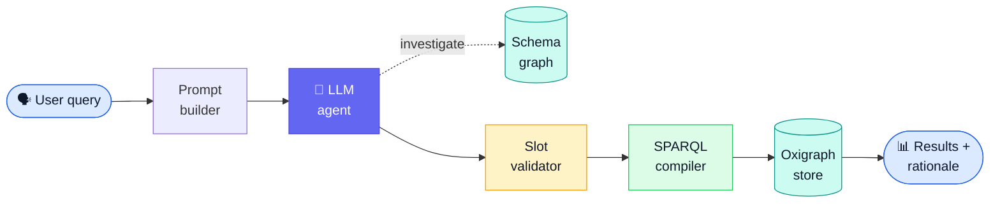

<SlideProvider :total-slides="10">
<SlideDeck>

<Slide :index="0" variant="title">
  
Conference Overview

  
Ontology-grounded retrieval for ENVITED-X simulation assets

  <h1>Ontology-Based Natural Language Search</h1>
  
A trustworthy path from plain-language questions to deterministic, ontology-compliant SPARQL — without asking users to learn schemas, prefixes, or query languages.

  

    

      <strong>45</strong>
      OWL + SHACL files loaded into the schema graph
    

    

      <strong>22</strong>
      Ontology domains discoverable through one search interface
    

    

      <strong>0</strong>
      LLM-written SPARQL — compilation stays deterministic
    

  

  
Press → or Space to navigate · Swipe on mobile · Live demo on the final slide

</Slide>

<Slide :index="1">
  
The challenge

  <h2>Rich metadata is only useful if people can actually reach it.</h2>
  
The ENVITED-X Data Space already contains deeply structured simulation asset metadata — road types, lane configurations, locations, quality measures, formats, and relationships.

  

    

      <h3>Complex semantics</h3>
      
Assets are described through ontologies, shapes, and domain-specific properties.

    

    

      <h3>Access barrier</h3>
      
Most users do not know SPARQL, prefixes, or the ontology schema behind the data.

    

    

      <h3>Trust gap</h3>
      
Search must stay explainable, safe, and precise — not just convenient.

    

  

  
Users ask for “German motorways with 3 lanes” — not for classes, predicates, and manually assembled graph queries.

</Slide>

<Slide :index="2">
  
The solution

  <h2>An AI interface with deterministic guardrails.</h2>
  
The system translates natural language into validated search slots, then compiles those slots into verified SPARQL with full transparency about interpretation, gaps, and results.

  

    

      
🗣️

      <h3>Natural input</h3>
      
Plain-language search in any language, with no ontology expertise required.

    

    

      
🧠

      <h3>Ontology-grounded interpretation</h3>
      
The LLM maps intent against vocabulary extracted directly from OWL + SHACL.

    

    

      
🎯

      <h3>Deterministic execution</h3>
      
Validated slots compile to precise SPARQL with confidence and traceability.

    

  

</Slide>

<Slide :index="3" variant="diagram">
  
System architecture

  <h2>LLM flexibility in front. Deterministic compilation underneath.</h2>

  

    

      <h3>Schema-driven prompt</h3>
      
Raw SHACL shapes are injected into the prompt at startup — the LLM sees all properties and allowed values natively.

    

    

      <h3>Investigation tools</h3>
      
The LLM can query the schema graph via SPARQL to discover domains, properties, and values at runtime.

    

    

      <h3>Readable outcome</h3>
      
Users see what the system understood (interpretation, gaps, confidence) before results arrive.

    

  

</Slide>

<Slide :index="4">
  
Core innovation

  <h2>Why slot-based compilation beats direct query generation.</h2>
  
The model never writes raw SPARQL. It fills structured slots, and a deterministic compiler turns those slots into safe, reproducible queries.

  

    

      Direct generation
      <h3>Unstructured SPARQL from the model</h3>
      <ul class="tight-list">
        <li>Can hallucinate invalid graph patterns</li>
        <li>Outputs vary between runs</li>
        <li>Hard to validate or refine safely</li>
      </ul>
    

    

      Slot compilation
      <h3>LLM fills typed search intent</h3>
      <ul class="tight-list">
        <li>Compiler always emits valid SPARQL</li>
        <li>Results stay deterministic and reproducible</li>
        <li>Post-LLM validation corrects mistakes</li>
      </ul>
    

    

      What changes
      <h3>Better trust, safer execution</h3>
      <ul class="tight-list">
        <li>Confidence can be recomputed against real ontology values</li>
        <li>Domain mismatches are corrected before execution</li>
        <li>Users see gaps instead of silent failure</li>
      </ul>
    

  

</Slide>

<Slide :index="5">
  
Ontology grounding

  <h2>The vocabulary comes from the ontology itself.</h2>
  
Allowed values are auto-extracted from OWL + SHACL at startup, so the search assistant stays synchronized with the source ontologies instead of relying on a manually curated vocabulary layer.

  

    

      <h3>Example query</h3>
      
“German highways with 3 lanes”

      <ul class="tight-list">
        <li><strong>German</strong> → <code>country: "DE"</code></li>
        <li><strong>highways</strong> → <code>roadTypes: "motorway"</code></li>
        <li><strong>3 lanes</strong> → <code>laneCount.min = 3</code></li>
      </ul>
    

    

      <h3>Validation after interpretation</h3>
      <ul class="tight-list">
        <li>Slot Validator confirms <code>DE</code> and <code>motorway</code> against <code>sh:in</code> vocabulary.</li>
        <li>Domain correction verifies that the query belongs to the <code>hdmap</code> domain.</li>
        <li>Only then does the compiler produce the final SPARQL query.</li>
      </ul>
    

  

  

    Runtime path 
    Query → slot extraction → vocabulary check (<code>sh:in</code>) → domain correction → deterministic compiler
  

</Slide>

<Slide :index="6">
  
Implementation

  <h2>Built for transparency, speed, and maintainability.</h2>
  

    

      Runtime
      <strong>Node.js + TypeScript 5.9</strong>
      
Strict-mode foundation for predictable backend logic.

    

    

      Frontend
      <strong>Vite + React + TanStack Router</strong>
      
Fast, modern UI for streaming search results.

    

    

      API
      <strong>Hono</strong>
      
Lightweight SSE-ready interface for progressive responses.

    

    

      AI
      <strong>Copilot SDK / Vercel AI SDK</strong>
      
Multi-provider agent layer with the same validation pipeline.

    

    

      SPARQL
      <strong>Oxigraph</strong>
      
In-process query execution with a graph-native data model.

    

    

      Ontology
      <strong>OWL + SHACL</strong>
      
Vocabulary and constraints extracted directly from source ontologies.

    

    

      Monorepo
      <strong>pnpm workspaces + Turborepo</strong>
      
Clear package boundaries for API, search, ontology, and docs.

    

    

      Testing
      <strong>Vitest + Playwright</strong>
      
Unit and end-to-end coverage for deterministic behavior.

    

  

</Slide>

<Slide :index="7">
  
Ontology-agnostic design

  <h2>Works with any ontology — not just ENVITED-X.</h2>
  
The system discovers all structure from the OWL + SHACL schema graph at runtime. Zero hardcoded domain names, predicates, or class IRIs in production code.

  

    

      
🔍

      <h3>Property Path Discovery</h3>
      
Walks SHACL shapes to find predicate chains from asset classes to leaf properties — no hardcoded <code>hasDomainSpecification</code>.

    

    

      
🗺️

      <h3>Domain Registry</h3>
      
Asset types discovered via <code>rdfs:subClassOf</code> + <code>sh:targetClass</code> — swap ontologies, get new domains automatically.

    

    

      
🔗

      <h3>Smart Location Delegation</h3>
      
Location filters route to whichever domain has location properties — no hardcoded georeference assumption.

    

  

  
Replace ENVITED-X with a retail ontology ("outdoor-shoes", "winter-jackets") — the same pipeline handles "waterproof hiking boots under €100" without code changes.

</Slide>

<Slide :index="8">
  
RDF reasoning at runtime

  <h2>The LLM explores the ontology using SPARQL — before filling slots.</h2>
  
Five investigation tools give the agent on-demand access to the schema graph. The LLM can discover domains, properties, allowed values, and cross-domain connections dynamically.

  

    

      discover_domains
      <strong>What asset types exist?</strong>
      
Lists all searchable domains from <code>sh:targetClass</code> declarations.

    

    

      discover_properties
      <strong>What filters are available?</strong>
      
Returns property names, datatypes, and whether they have <code>sh:in</code> enumerations.

    

    

      discover_values
      <strong>What values are valid?</strong>
      
Extracts exact allowed values from <code>sh:in</code> RDF lists.

    

    

      discover_connections
      <strong>How do domains relate?</strong>
      
Finds cross-domain references via manifest artifacts.

    

    

      investigate_schema
      <strong>Full SPARQL exploration</strong>
      
The LLM writes arbitrary SELECT queries against the schema graph.

    

  

  

    Key insight 
    The same SPARQL engine that executes user queries also serves as a reasoning backend for the LLM agent — the schema graph is both compiler metadata <em>and</em> an explorable knowledge base.
  

</Slide>

<Slide :index="9" variant="cta">
  
Live Demo

  
Experience the search assistant end to end

  <h2>See the ontology search workflow in action.</h2>
  
Ask about HD maps, scenarios, or simulation assets in plain language — then inspect the interpretation, gaps, and compiled SPARQL with the live application.

  

    <a href="http://localhost:5174" class="btn-primary">Launch live demo →</a>
    <a href="/docs/architecture" class="btn-secondary">Read the architecture →</a>
  

  
Live demo: <a href="http://localhost:5174" class="demo-link">http://localhost:5174</a> · Example prompts: “motorway HD maps in Germany” · “OpenDRIVE with 3 lanes” · “Autobahnen mit Überholmanöver”

</Slide>

</SlideDeck>
<SlideControls />
</SlideProvider>
