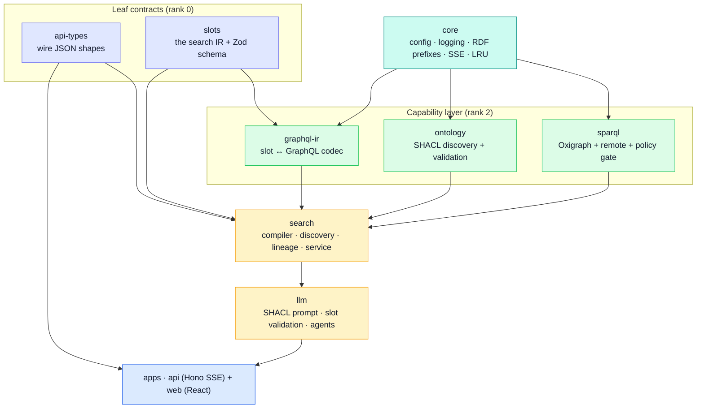
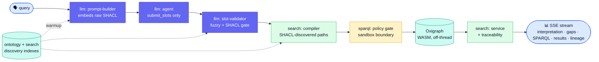
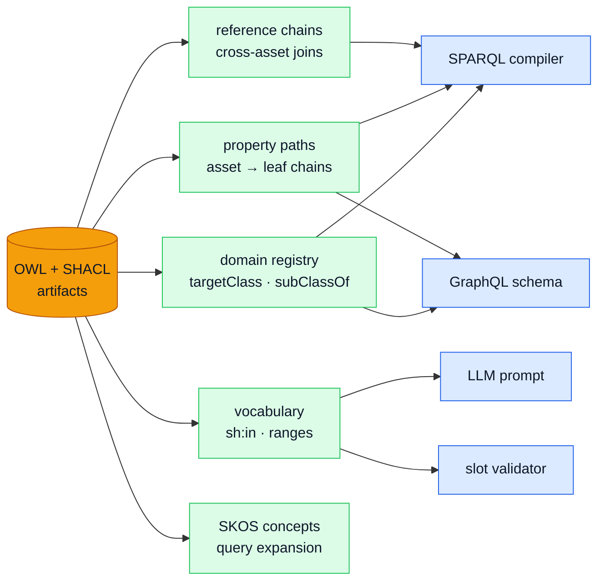

<SlideProvider :total-slides="12">
<SlideDeck>

<Slide :index="0" variant="title">
  
Architecture Overview

  
A trustworthy natural-language interface over any ontology-described data space

  <h1>Ontology-Based Natural Language Search</h1>
  
Plain-language questions become deterministic, ontology-compliant SPARQL — and the only thing that has to change to support a new domain is the ontology, not the code.

  

    

      <strong>0</strong>
      lines of LLM-written SPARQL — the model fills typed slots, a compiler emits the query
    

    

      <strong>0</strong>
      hardcoded domain names, predicates, or class IRIs in production code
    

    

      <strong>1</strong>
      source of truth — the OWL + SHACL artifacts drive every layer
    

  

  
Press → or Space to navigate · 1) purpose · 2) architecture &amp; standards · 3) the ontology-artifact core

</Slide>

<Slide :index="1">
  
Purpose · 30 seconds

  <h2>Make rich, governed metadata reachable in plain language — without sacrificing trust.</h2>
  
Data spaces like ENVITED-X already publish deeply structured asset metadata as ontologies (OWL) and constraints (SHACL). That richness is wasted if reaching it requires SPARQL, prefixes, and schema expertise.

  

    

      <h3>The asset</h3>
      
Governed, standards-based metadata: classes, shapes, allowed values, cross-references — already curated for interoperability.

    

    

      <h3>The barrier</h3>
      
Users think in "German motorways with 3 lanes", not in <code>sh:targetClass</code>, prefixes, and hand-assembled graph patterns.

    

    

      <h3>The non-negotiable</h3>
      
Search must stay explainable, safe, and reproducible — convenience cannot come at the cost of correctness.

    

  

</Slide>

<Slide :index="2">
  
Why it's innovative

  <h2>Flexibility in front, determinism underneath — and the ontology drives both.</h2>
  
The usual choice is "LLM writes the query (flexible but unsafe)" or "rigid forms (safe but rigid)". This system refuses the trade-off with two ideas working together.

  

    

      Idea 1 · the boundary
      <h3>The LLM never writes SPARQL</h3>
      <ul class="tight-list">
        <li>It fills one typed <code>submit_slots</code> tool call — a structured intermediate representation.</li>
        <li>A deterministic compiler turns those slots into SPARQL. Same slots ⇒ byte-identical query.</li>
        <li>No prompt injection can produce an arbitrary query — there is no path from text to the store.</li>
      </ul>
    

    

      Idea 2 · the source of truth
      <h3>Everything is derived from the ontology</h3>
      <ul class="tight-list">
        <li>Prompt vocabulary, slot values, predicate paths, cross-reference joins, validation — all read from OWL + SHACL at runtime.</li>
        <li>No domain knowledge is baked into code.</li>
        <li>Swap the ontology, and a new domain works with zero code change.</li>
      </ul>
    

  

  
The result: an AI search experience with the safety profile of a compiler and the reach of the ontology behind it.

</Slide>

<Slide :index="3" variant="diagram">
  
Architecture · the module graph

  <h2>A strictly layered monorepo — small packages, one-way dependencies, no cycles.</h2>

  
A CI layer-gate enforces the arrows: every dependency points strictly downward, so the graph can never grow a cycle. Each box is a publishable unit with its own README, requirements table, and tests.

</Slide>

<Slide :index="4" variant="diagram">
  
Architecture · the request pipeline

  <h2>One query, end to end — and where each module does its job.</h2>

  

    

      <h3>Two-stage validation</h3>
      
The validator fuzzy-corrects values against <code>sh:in</code>, then a SHACL gate drops anything that violates a real constraint — surfaced to the user as gaps.

    

    

      <h3>Deterministic compile</h3>
      
The compiler walks SHACL-discovered predicate paths and reference chains — no fixed predicate names — and emits one reproducible query.

    

    

      <h3>Streamed transparency</h3>
      
Every phase is an SSE event: users see the interpretation, gaps, and the exact SPARQL before results, plus per-row lineage after.

    

  

</Slide>

<Slide :index="5">
  
Architecture · the modules

  <h2>Each package owns one responsibility, with a contract its tests pin.</h2>
  

    

      slots · rank 0
      <strong>The search IR</strong>
      
<code>SearchSlots</code> + the Zod wire schema. The system's central contract; held to JSON Schema 2020-12.

    

    

      api-types · rank 0
      <strong>Wire shapes</strong>
      
Zero-dependency, browser-safe HTTP/SSE types shared by server and client — drift is impossible by construction.

    

    

      core · rank 1
      <strong>Foundations</strong>
      
Zod config, structured logging, typed errors, the canonical RDF prefix map, SSE framing, a bounded LRU.

    

    

      sparql · rank 2
      <strong>Execution + sandbox</strong>
      
Oxigraph (WASM, off-thread) and a remote Fuseki store behind one cache, plus the policy gate that is the security boundary.

    

    

      ontology · rank 2
      <strong>Discovery + validation</strong>
      
Domain registry from <code>sh:targetClass</code> + <code>rdfs:subClassOf</code>; SHACL Core validation; source resolution.

    

    

      graphql-ir · rank 2
      <strong>Slot ↔ GraphQL codec</strong>
      
Serializes slots to a spec-valid GraphQL query and parses it back — the editable surface the web app mirrors.

    

    

      search · rank 3
      <strong>Compiler + pipeline</strong>
      
Deterministic SPARQL compilation, schema discovery, lineage, and the orchestration service.

    

    

      llm · rank 4
      <strong>Interpretation</strong>
      
SHACL-grounded prompt, fuzzy + SHACL slot validation, and a multi-provider agent restricted to one tool.

    

  

</Slide>

<Slide :index="6">
  
Standards · not invention

  <h2>Every boundary speaks a standard.</h2>
  
The system is glue between well-specified contracts. Each interface cites its normative spec, audited in <code>docs/standards-audit.md</code>.

  

    

      
◆

      <h3>The graph</h3>
      
<strong>RDF 1.1 · OWL · SHACL</strong> describe and constrain the data; <strong>SKOS</strong> gives concept hierarchies for query expansion.

    

    

      
◆

      <h3>The query</h3>
      
<strong>SPARQL 1.1</strong> is the only thing that touches the store — compiled, escaped to grammar, and policy-checked.

    

    

      
◆

      <h3>The contracts</h3>
      
<strong>JSON Schema 2020-12</strong> grounds the slot tool call; <strong>GraphQL</strong> is the editable query surface; <strong>RFC 8259 / 9110 / SSE</strong> carry it over the wire.

    

  

  

    Why it matters 
    Standards-pinned boundaries mean each layer is independently testable, swappable, and partner-consumable — and "is this correct?" reduces to "does it conform to the spec?".
  

</Slide>

<Slide :index="7">
  
Open source · leverage, don't reinvent

  <h2>Best-in-class libraries do the heavy lifting.</h2>
  

    

      SPARQL engine
      <strong>Oxigraph (WASM)</strong>
      
In-process SPARQL 1.1, run off the main thread in a worker; a remote Apache Jena Fuseki store swaps in for production.

    

    

      SHACL + RDF
      <strong>rdf-validate-shacl · N3 · rdfjs</strong>
      
Zazuko's validator, the N3 Turtle parser, and the RDF/JS dataset model parse and check the shapes graph.

    

    

      Query tooling
      <strong>sparqljs · graphql-js 17 · @zazuko/prefixes</strong>
      
SPARQL parsing/validation, the GraphQL codec, and the canonical prefix map — single sources of truth.

    

    

      AI
      <strong>Vercel AI SDK + GitHub Copilot SDK</strong>
      
Five providers (OpenAI, Anthropic, claude-cli, vibe-cli/Mistral, Ollama) plus Copilot — one validation pipeline behind them all.

    

    

      App platform
      <strong>Hono · Vite · React 19 · TanStack Router</strong>
      
An SSE-native API and a streaming React UI, built and orchestrated by pnpm workspaces + Turborepo.

    

    

      Deliberate keeps
      <strong>SSE parser · LRU · Levenshtein</strong>
      
Three small bespoke utilities, each justified in an ADR — kept because the library alternatives are not drop-in or add no measurable benefit.

    

  

</Slide>

<Slide :index="8">
  
The security model

  <h2>Two gates make the AI path safe by construction.</h2>
  

    

      <h3>Gate 1 · the slot IR</h3>
      
text → typed slots → SPARQL

      <ul class="tight-list">
        <li>The model's only output channel is the <code>submit_slots</code> tool — prose is ignored.</li>
        <li>Slots are validated and corrected against the live SHACL vocabulary before they reach the compiler.</li>
        <li>The compiler is the sole, deterministic SPARQL author.</li>
      </ul>
    

    

      <h3>Gate 2 · the policy sandbox</h3>
      <ul class="tight-list">
        <li>Only <code>SELECT</code> runs; writes, <code>SERVICE</code>, and graph redirection are rejected.</li>
        <li>The prefix allowlist derives from the same <code>RDF_PREFIXES</code> the compiler emits — it cannot drift.</li>
        <li>A <code>LIMIT</code> ceiling is enforced; literals are escaped to the SPARQL 1.1 grammar (fuzz-tested).</li>
      </ul>
    

  

  
Neither gate trusts the model. Prompt injection can change <em>what</em> is asked, never <em>what query runs</em>.

</Slide>

<Slide :index="9" variant="diagram">
  
The beautiful core

  <h2>The ontology artifacts are the program.</h2>
  
One set of OWL + SHACL files, discovered once at warmup, becomes every moving part below. Nothing about a specific ontology is written in code.

  

    Discovery, not configuration 
    Predicate paths and reference signatures <code>(sourceClass, path, targetClass)</code> are found by walking the shapes graph and typed instances at warmup — so the meta-model is read, never assumed.
  

</Slide>

<Slide :index="10">
  
What this enables · long run

  <h2>Generality is the product.</h2>
  
Because the artifacts are the source of truth, the same engine generalizes far beyond ENVITED-X — and the model it discovers can itself become a published asset.

  

    

      
♻️

      <h3>Any data space, for free</h3>
      
Point it at a retail, biomedical, or industrial ontology and "waterproof boots under €100" works with no code change. The data space's governance artifacts <em>become</em> its search interface.

    

    

      
📦

      <h3>The discovered model as an artifact</h3>
      
The search surface the system derives — domains, paths, vocabulary, the GraphQL SDL — can be published and versioned: a cacheable, partner-consumable contract that warm-starts the engine.

    

    

      
🤝

      <h3>Standard partner contracts</h3>
      
Because the query surface is GraphQL and the store is standard SPARQL 1.1 / Fuseki, partners integrate through interfaces they already know — no bespoke API to learn.

    

  

  
Today it answers questions about simulation assets. The architecture's real claim is that <strong>publishing a good ontology is enough to get a trustworthy natural-language interface over your data.</strong>

</Slide>

<Slide :index="11" variant="cta">
  
Live Demo

  
The whole architecture in one sentence

  <h2>The LLM interprets; the ontology decides; the compiler executes.</h2>
  
Ask about HD maps, scenarios, or simulation assets in plain language — then inspect the interpretation, the gaps, the compiled SPARQL, and the per-row lineage in the live app.

  

    <a href="http://localhost:5174" class="btn-primary">Launch live demo →</a>
    <a href="/docs/architecture" class="btn-secondary">Read the architecture →</a>
  

  
Try: “motorway HD maps in Germany” · “OpenDRIVE with 3 lanes” · “Autobahnen mit Überholmanöver”

</Slide>

</SlideDeck>
<SlideControls />
</SlideProvider>
