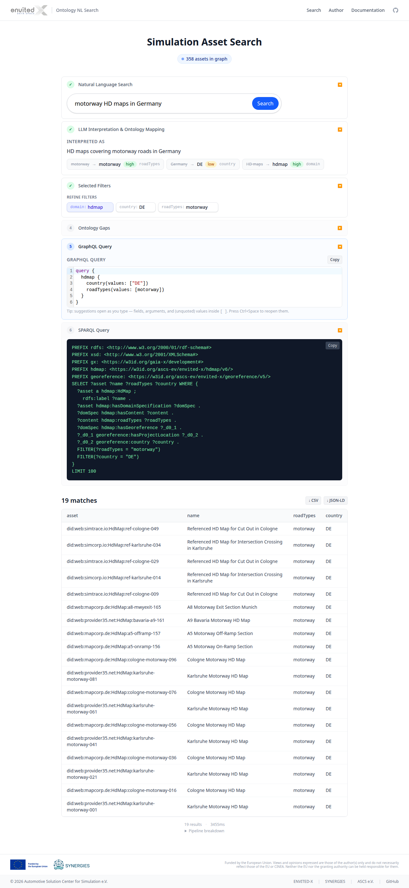
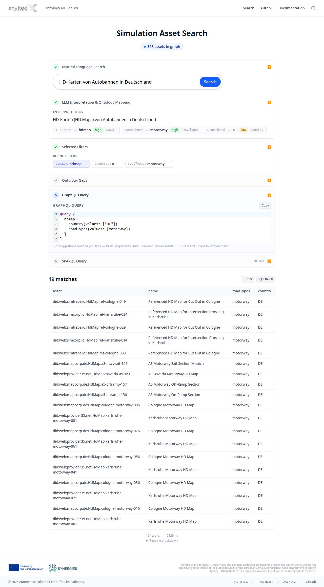
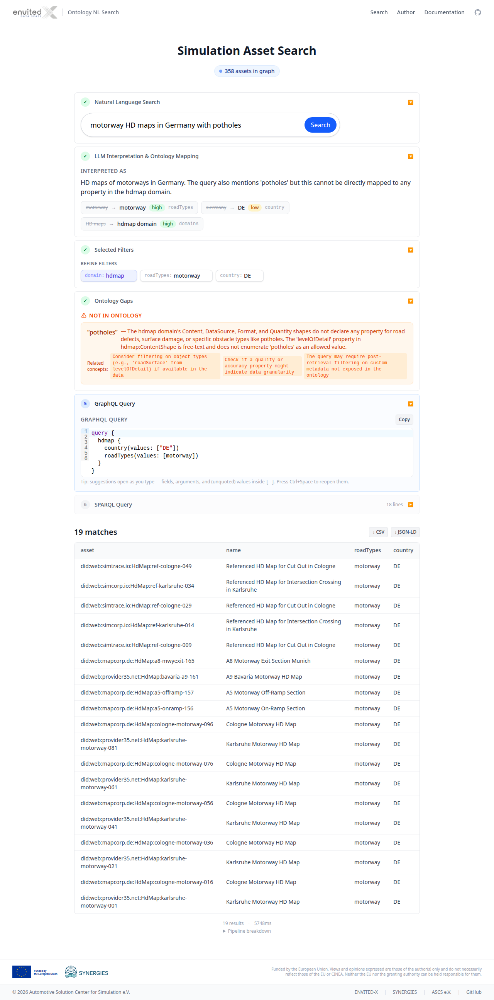
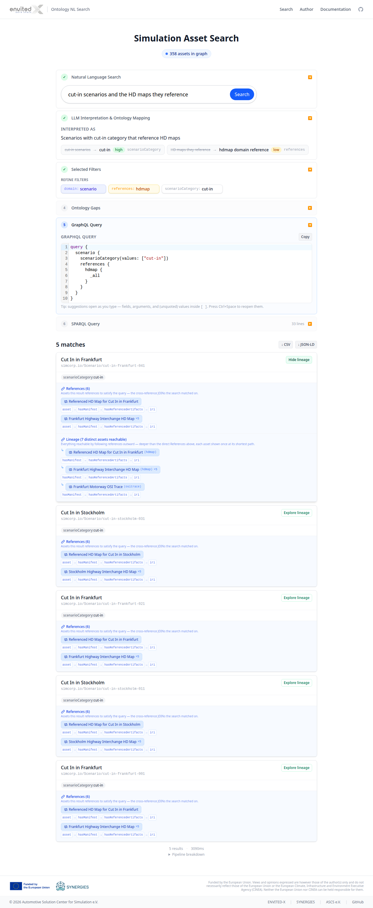
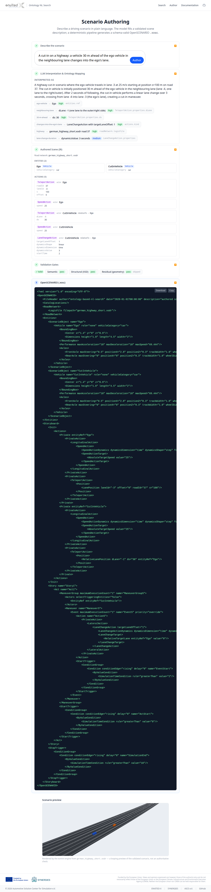

<SlideProvider :total-slides="19">
<SlideBrand />
<SlideDeck>

<Slide :index="0" variant="title">
  

    

      
EU project SYNERGIES

      <h1>Formal models are the dictionary. LLMs are the translator.</h1>
      
Agent-assisted modelling, natural-language search and synthetic scenarios, built on open standards.

      

        ModelLoopUseInvertStandardize
      

    

    <TitleArt />
  

  
Funded by the European Union. Views and opinions expressed are however those of the author(s) only and do not necessarily reflect those of the European Union or the European Climate, Infrastructure and Environment Executive Agency (CINEA). Neither the European Union nor CINEA can be held responsible for them.

</Slide>

<Slide :index="1">
  
Model · 01 · Languages

  <h2>Formal modelling is nothing new. Writing it just got fast.</h2>
  

    
1994EXPRESS (STEP)

    
1997UML

    
2001XML Schema

    
2004OWL

    
2017SHACL

    
NowAgents draft. Generators derive. Validators check.

  

  
One LinkML schema → OWL + SHACL + JSON-LD context. One UML model → XSD + OWL + SHACL.

  
Generators in use: LinkML (gen-owl, gen-shacl, gen-jsonld-context) · ShapeChange · owl2shacl

</Slide>

<Slide :index="2">
  
Model · 02 · Human in the loop

  <h2>Agents work best against specs. Specs keep humans in the loop.</h2>
  

    
SpecificationDefines what “correct” means: W3C, ASAM

    →
    
AgentDrafts the model, the examples, the tests

    →
    
HumanReviews a small, declarative model diff

  

  
Review what the model means, not thousands of lines of code.

  
Measured: the four OMB domains being re-modelled in LinkML catch 963 of 999 adversarial probes derived from the hand-written shapes (work in progress).

</Slide>

<Slide :index="3">
  
Loop · 03 · Validation

  <h2>Build circles, not pipelines.</h2>
  

    
ModelLinkML · UML

    →
    
Generatorgen-owl · ShapeChange

    →
    
ArtifactsOWL · SHACL · XSD

    ↑
    
AI can help at every station. A machine checks every turn.

    ↓
    
ValidatorOMB, in CI

    
    
Example dataValid + broken on purpose

  

  
Ontology Management Base: LinkML artifacts must regenerate byte-identical; each domain's example data is SHACL-validated.

</Slide>

<Slide :index="4">
  
Use · 04 · Open standards

  <h2>Build on open standards. Compete on what you build on top.</h2>
  

    
RDF · JSON-LDAny RDF triple store

    
SPARQL 1.1Oxigraph · Apache Jena Fuseki

    
SHACLValidation is a library call

    
GraphQLThe API developers already know

    
JSON SchemaTyped tool calls for agents

    
OWL 2Editors, reasoners, generators

  

  
The code we wrote is glue between standards.

</Slide>

<Slide :index="5">
  
Use · 05 · Translation

  <h2>LLMs translate. OWL + SHACL are dictionary and grammar.</h2>
  

    
Your words“HD-Karten von Autobahnen in Deutschland”

    →
    
LLM + ontologyDictionary: classes, allowed values. Grammar: shapes.

    →
    
Typed slotsOne tool call, checked against SHACL

    →
    
CompilerDeterministic SPARQL

  

  
The LLM never writes the query. A prompt injection can change what is asked, never how the query is built.

</Slide>

<Slide :index="6" variant="cta">
  
Use · Live demo · Search

  <h2>Ask in your own words.</h2>
  <ol class="prompts prompts--compact" aria-label="Search prompts for the live demo">
    <li>motorway HD maps in Germany<small>SPARQL · GraphQL · 19 maps</small></li>
    <li>HD-Karten von Autobahnen in Deutschland<small>the identical query</small></li>
    <li>motorway HD maps in Germany with potholes<small>plus one gap</small></li>
    <li>cut-in scenarios and the HD maps they reference<small>lineage</small></li>
  </ol>
  

    Watch forInterpretationGapsSPARQLLineage
  

</Slide>

<Slide :index="7" variant="cta">
  
Backup · recorded run · search 1 of 4

  <h2 class="backup-title">motorway HD maps in Germany</h2>
  

    
  

</Slide>

<Slide :index="8" variant="cta">
  
Backup · recorded run · search 2 of 4

  <h2 class="backup-title">HD-Karten von Autobahnen in Deutschland</h2>
  

    
  

</Slide>

<Slide :index="9" variant="cta">
  
Backup · recorded run · search 3 of 4

  <h2 class="backup-title">motorway HD maps in Germany with potholes</h2>
  

    
  

</Slide>

<Slide :index="10" variant="cta">
  
Backup · recorded run · search 4 of 4

  <h2 class="backup-title">cut-in scenarios and the HD maps they reference</h2>
  

    
  

</Slide>

<Slide :index="11">
  
Use · 06 · Gaps

  <h2>Gaps show where the language needs to grow.</h2>
  

    
Not in ontologyThe concept does not exist yet

    
Understood, not filteredRecognized, but no property to filter on

    
Query limitationThe engine cannot express it yet

  

  
Experts model the language first. Users then show what it cannot say yet.

</Slide>

<Slide :index="12">
  
Use · 07 · Lineage

  <h2>Data lineage has never been easier.</h2>
  

    
ScenarioCut-in in Frankfurt

    →
    
OSI traceFrankfurt motorway

    →
    
HD mapsFrankfurt interchange

  

  
A reference is a typed link, not free text, so lineage is a query, not a separate system.

  
From the synthetic sample data: one scenario reaches 7 assets through its manifest, each with a did:web identifier.

</Slide>

<Slide :index="13">
  
Invert · 08 · Generation

  <h2>If we can search it, we can generate it.</h2>
  

    Search
    
words → typed slots → SPARQL → existing assets

    Author
    
words → typed scene → OpenSCENARIO XML → checks → playback

  

  
Synthetic scenarios, valid by construction and described by the same ontology.

  
Checks: SHACL from ASAM's OpenSCENARIO model · XSD 1.3.0 via the open-source OpenSCENARIO API (WebAssembly) · road rules. Playback: esmini.

</Slide>

<Slide :index="14" variant="cta">
  
Invert · Live demo · Authoring

  <h2>Describe it. Get a valid OpenSCENARIO file.</h2>
  <ol class="prompts" aria-label="Authoring prompt for the live demo">
    <li>A cut-in on a highway: a vehicle 30 m ahead of the ego vehicle in the neighbouring lane changes into the ego's lane.<small>Actors, actions, and the road the scene binds to</small></li>
  </ol>
  

    Watch forModel choicesSemantic · structural · road checksesmini preview.xosc export
  

</Slide>

<Slide :index="15" variant="cta">
  
Backup · recorded run · authoring 1 of 2

  <h2 class="backup-title">A cut-in on a highway: a vehicle 30 m ahead of the ego vehicle in the neighbouring lane changes into the ego's lane.</h2>
  

    
  

</Slide>

<Slide :index="16" variant="cta">
  
Backup · recorded run · authoring 2 of 2

  <h2 class="backup-title">The generated scenario, played by esmini</h2>
  

    <video
      src="./demo-backup/6-author-preview.webm"
      poster="./demo-backup/6-author-preview.png"
      autoplay
      loop
      muted
      playsinline
      aria-label="Recording of the esmini preview: the vehicle 30 m ahead in the neighbouring lane moves into the ego vehicle's lane"
    ></video>
  

</Slide>

<Slide :index="17">
  
Standardize · 09 · ASAM OpenX

  <h2>Standardize in models, not in prose.</h2>
  

    
TodayUML plus prose, the XSD built in a proprietary tool. Ontologies come later, one silo each.

    
NextOne ASAM OpenX ontology. Models authored with agents, reviewed like code.

    
Open pipelinesGenerate XSD, OWL, SHACL and docs from one source.

  

  
Already working: OpenSCENARIO.xsd regenerated byte-identical from ASAM's UML model, in an open pipeline outside Enterprise Architect.

  
UML → ShapeChange → OWL → owl2shacl → SHACL · fixes submitted upstream to both tools

</Slide>

<Slide :index="18" variant="cta">
  
Close the loop

  <h2>Model. Loop. Use. Invert. Standardize.</h2>
  

    Formal models are the dictionary.
    LLMs are the translator.
    Agents close the loop, and humans stay in it.
  

  
So far: about 20 ontology domains searchable · no LLM-written SPARQL · OpenSCENARIO.xsd rebuilt byte-identical · 12 of 12 rehearsal scenarios valid

  
synergies-ccam.eu · github.com/ASCS-eV/ontology-based-nl-search · github.com/ASCS-eV/ontology-management-base

  
Funded by the European Union. Views and opinions expressed are however those of the author(s) only and do not necessarily reflect those of the European Union or the European Climate, Infrastructure and Environment Executive Agency (CINEA). Neither the European Union nor CINEA can be held responsible for them.

</Slide>

</SlideDeck>

<SlideNotes :index="0" title="Formal models are the dictionary. LLMs are the translator." timing="0:00–1:00 · 60 seconds">
  
These are results from the EU project SYNERGIES, which aims at a federated scenario data space and at real-world and synthetic scenarios for testing automated driving. Finding and creating the right scenario is still slow expert work.

  
For more than thirty years we have been able to describe data formally, but most of that rigor stayed locked in models only experts could write.

  
My claim: formal models are the dictionary and the grammar, and large language models are the translator. In closed loops, with a human reviewing every turn, that gives us search in plain language, synthetic scenarios that are valid by construction, and standards that are modelled instead of written.

  
Five parts, two live demos.

  
[Cue: name SYNERGIES first, then read the headline slowly and point along the five parts. Transition: “Let me start with a confession.”]

</SlideNotes>

<SlideNotes :index="1" title="Formal modelling is nothing new. Writing it just got fast." timing="1:00–2:30 · 90 seconds">
  
Let me start with a confession: nothing on this timeline is new. From EXPRESS in 1994, the language of STEP, to SHACL in 2017, we have had precise, machine-checkable modelling languages for a generation.

  
What held us back was the effort of writing them. A good ontology needed a rare expert and a lot of patience, and it drifted away from the code around it.

  
Two things changed. First, the generators matured. With LinkML I write one schema and derive OWL, SHACL and a JSON-LD context from it. ShapeChange and owl2shacl do the same from a UML model. Second, these languages suit language models well: small, precisely specified, and documented in public in great detail. An agent drafts a SHACL shape the way it drafts a function.

  
So modelling becomes a conversation with an assistant, not a solo expert task. That is how we are re-modelling domains of the Ontology Management Base in LinkML right now: an agent at the keyboard, a human deciding.

  
[Cue: sweep left to right along the years, stop on “Now”. Transition: “Why does an agent do this well?”]

</SlideNotes>

<SlideNotes :index="2" title="Agents work best against specs. Specs keep humans in the loop." timing="2:30–4:00 · 90 seconds">
  
Why does this work so well? Because agents are at their best when there is a specification to develop against. The specification tells the agent what correct means, and it tells me how to check the result.

  
It also keeps the human in the loop. Reviewing thousands of lines of generated code takes a long time. When an agent changes a model, the diff is small and declarative: a new class, a new allowed value, a cardinality. My domain experts can read that, and we discuss it in a pull request.

  
And it is measurable. The four OMB domains we are re-modelling in LinkML catch 963 of 999 adversarial probes derived from the hand-written shapes. The specification defines correctness, the agent does the typing, and the human decides what the model should mean.

  
One distinction for the rest of the talk: agents are the assistants we build with. At runtime, a language model only translates.

  
[Cue: point to the three boxes in order; rest on “Human”, then on the measured line. Transition: “But a model on its own proves nothing.”]

</SlideNotes>

<SlideNotes :index="3" title="Build circles, not pipelines." timing="4:00–5:30 · 90 seconds">
  
A model on its own proves nothing. So the third ingredient is the most important one: we build circles, not pipelines.

  
The model feeds a generator. The generator produces artifacts: OWL, SHACL, JSON-LD contexts, and in the ASAM case, XML Schemas. Then we need example data: valid instances, and instances that are broken on purpose. And a validator checks that data against the artifacts. In our case that is the Ontology Management Base, OMB, which validates the example data of every domain in continuous integration. Whatever fails goes back to the model, and the loop turns again.

  
The AI can help at every station: it drafts the model, writes examples, explains a violation. But every turn is checked by a machine. OMB regenerates its LinkML artifacts in CI and fails on a single byte of difference.

  
That is how an agent can work fast while we still trust the result.

  
[Cue: trace the loop with your hand, clockwise from Model back to Model. Transition: “Once you trust your models, something interesting happens.”]

</SlideNotes>

<SlideNotes :index="4" title="Build on open standards. Compete on what you build on top." timing="5:30–7:00 · 90 seconds">
  
Now we have formal data models, and we are confident in working with them. This is where the payoff starts: we do not have to rebuild the foundation. We plug in.

  
Our data is RDF, so any RDF triple store can hold it. Oxigraph runs in-process during development, Apache Jena Fuseki in production. Both speak SPARQL 1.1: one standard query language for all of it. The constraints are SHACL, so validation is a library call, not a project. The same shapes give us a GraphQL surface that every web developer already knows. And the agents build on the same foundations: their tool calls are typed with JSON Schema.

  
Think about what this frees up. Instead of every organization rebuilding databases, query builders and validators for simulation data, we share the foundation and compete on what we build on top. The code we wrote is glue between standards, and every boundary cites its specification. Is a component correct? That becomes: does it conform to the standard?

  
[Cue: point to two or three tiles, not all six. Transition: “Which brings me to natural language.”]

</SlideNotes>

<SlideNotes :index="5" title="LLMs translate. OWL + SHACL are dictionary and grammar." timing="7:00–8:30 · 90 seconds">
  
Which brings me to natural language. The distance between how people talk and how formal models are written has always been the last mile. Here is the insight: that distance is a translation problem, and translating is what large language models are genuinely great at.

  
So we give the model a dictionary and a grammar. The dictionary is the ontology: classes, properties, allowed values. The grammar is SHACL: which property belongs to which shape, with which datatype. For every question we look up the right pages, and the matching SHACL fragments go into the prompt. The model's only job is to translate a sentence, in any language it speaks, into typed slots through one tool call. Then the slots are checked against the same shapes.

  
What the model never does is write SPARQL. A deterministic compiler does, so the same slots always produce the same query. That is also our security model: a prompt injection can change what is asked, never how the query is built. Only a compiled, read-only query reaches the database. Let me show you.

  
[Cue: follow the four boxes; pause on “Compiler”. Transition: switch to the prepared search tab.]

</SlideNotes>

<SlideNotes :index="6" title="Ask in your own words." timing="8:30–12:30 · 4 minutes">
  
Switch to the search tab. Say: “This is the access layer a federated scenario data space needs, one of the SYNERGIES goals. The data is synthetic: 358 generated sample assets in the shape of real ENVITED-X metadata.”

  
Submit “motorway HD maps in Germany”. While it streams, say: “Watch the pipeline. The model interprets, the slots are validated, the compiler writes the query.” Open the interpretation and point at the two filters: road type motorway, country DE. “This is the translation: values that exist in the ontology.” Expand the GraphQL and SPARQL panels: “The model did not write this. The compiler did.” Point at the 19 maps.

  
Submit “HD-Karten von Autobahnen in Deutschland”. “Same dictionary, another language.” Point out that the filters and the 19 maps are identical.

  
Submit “motorway HD maps in Germany with potholes”. Open the gaps panel: “Same 19 maps, plus one term the ontology cannot express. Not silently dropped, reported. Remember this; it is my next slide.”

  
Submit “cut-in scenarios and the HD maps they reference”. On the first result card, open “Explore lineage”: “Seven assets, reached by following typed links through the graph.” Then return to the deck.

  
[Cue: at most 30 seconds of recovery if a request fails: resubmit once, then press → for the four recorded backup slides. If the demo ran live, press → five times to skip them. Transition: “What you just saw in the gaps panel is the most underrated part.”]

</SlideNotes>

<SlideNotes :index="7" title="motorway HD maps in Germany" timing="12:30–12:30 · backup, only if the live demo fails">
  
Recorded run. Say: “This is a recorded run of the same flow.” Scroll down: the interpretation with its two filters, the GraphQL query, the SPARQL the compiler wrote, and the 19 maps.

  
[Cue: scroll the screenshot with the mouse wheel or trackpad.]

</SlideNotes>

<SlideNotes :index="8" title="HD-Karten von Autobahnen in Deutschland" timing="12:30–12:30 · backup, only if the live demo fails">
  
Recorded run. Say: “This is a recorded run of the same flow.” The German query produced the same two filters and the same 19 maps.

  
[Cue: scroll the screenshot with the mouse wheel or trackpad.]

</SlideNotes>

<SlideNotes :index="9" title="motorway HD maps in Germany with potholes" timing="12:30–12:30 · backup, only if the live demo fails">
  
Recorded run. Say: “This is a recorded run of the same flow.” Scroll to the gaps panel: “potholes” under Not in ontology, next to the same 19 maps.

  
[Cue: scroll the screenshot with the mouse wheel or trackpad.]

</SlideNotes>

<SlideNotes :index="10" title="cut-in scenarios and the HD maps they reference" timing="12:30–12:30 · backup, only if the live demo fails">
  
Recorded run. Say: “This is a recorded run of the same flow.” Scroll to the first result card: its references, then the lineage tree with seven reachable assets.

  
[Cue: scroll the screenshot with the mouse wheel or trackpad.]

</SlideNotes>

<SlideNotes :index="11" title="Gaps show where the language needs to grow." timing="12:30–14:00 · 90 seconds">
  
The gaps panel is, for me, the most underrated part of this work. The expert models the language first. But the users are the ones who reveal what the language cannot say yet.

  
Every query that mentions something the ontology does not cover produces a gap, and there are three kinds: not in the ontology, understood but not filterable, or a limitation of the query engine. None of this is silently dropped. A gap can also be the model's own mistake, so each one is a lead to check, not a verdict.

  
Here is a real one. Ask for German highways with three lanes, and the answer is: the HD-map ontology has no lane count. The concept exists, but in OpenLABEL's vocabulary, not where the maps are described. Keep that in mind for the end of the talk.

  
Now imagine collecting those gaps across all users of a data space. That is user research nobody had to organize, in the users' own words. The expert still decides how to model each one, but the backlog writes itself.

  
[Cue: point to the three columns, then make a circular gesture for the loop. Transition: “And one more thing you saw: lineage.”]

</SlideNotes>

<SlideNotes :index="12" title="Data lineage has never been easier." timing="14:00–15:00 · 60 seconds">
  
One more thing you saw: lineage. In a formal graph, a reference is not a string in a comment field. It is a typed link, declared in the asset's manifest and checked by its shape.

  
In the demo, one cut-in scenario reached seven assets: the HD maps it uses, and an OSI trace that points to the maps it was recorded on. Lineage needs no separate system; it is a query over the graph. And it answers what a safety case asks: which map and which recording does this test rest on?

  
[Cue: follow the chain left to right. Transition: “Now the crown.”]

</SlideNotes>

<SlideNotes :index="13" title="If we can search it, we can generate it." timing="15:00–16:30 · 90 seconds">
  
Now the crown. If we can search ontology-conform data, we can also create it. We run the same idea backwards.

  
In search, words become slots and slots become SPARQL. In authoring, words become a scene: actors, a road, actions. Again a typed intermediate representation, never raw XML from the model. Application code lowers the scene into ASAM OpenSCENARIO XML.

  
And the circle from earlier comes back. The scene is checked against SHACL shapes generated from ASAM's own OpenSCENARIO model. The document is validated against the official XML Schema by the open-source OpenSCENARIO API, compiled to WebAssembly and running inside the application. Residual rules check the scenario against the road. And esmini plays it back in the browser.

  
This is the second SYNERGIES goal: not only finding real-world scenarios, but generating synthetic ones, valid by construction and described by the same ontology. Valid is not the same as intended, though: whether it is the scenario I meant stays my decision, which is why you see the preview. Let me show you.

  
[Cue: point to the two rows as mirror images. Transition: switch to the prepared authoring tab.]

</SlideNotes>

<SlideNotes :index="14" title="Describe it. Get a valid OpenSCENARIO file." timing="16:30–20:30 · 4 minutes">
  
Switch to the authoring tab. Paste the prompt and submit it. While it streams, say: “The model fills a typed scene. It is not allowed to write XML.”

  
Open the scene. Name the two vehicles and the actions, and point at the 30 metres I asked for. Read the summary: “Speed and lane-change timing I did not specify. The model chose them, and it tells me what it chose.” Name the road the scene is bound to.

  
Open the gate results: “Three independent checks. Semantic, against ASAM's OpenSCENARIO shapes. Structural, against the official schema. Residual, against the road.” Point at the two skipped rules: “Skipped means not checked, and the tool says so.”

  
Start the preview: “This is esmini, playing the generated file in the browser. The car ahead moves into my lane.” Then show the XML and download the .xosc: “A standard OpenSCENARIO file. Any compliant tool can open it.” Return to the deck.

  
[Cue: at most 30 seconds of recovery if generation fails: resubmit once, then press → for the two recorded backup slides. If the demo ran live, press → three times to skip them. Transition: “Let me end with where this leads.”]

</SlideNotes>

<SlideNotes :index="15" title="A cut-in on a highway: a vehicle 30 m ahead of the ego vehicle in the neighbouring lane changes into the ego's lane." timing="20:30–20:30 · backup, only if the live demo fails">
  
Recorded run. Say: “This is a recorded run of the same flow.” Scroll down: the interpretation, the scene with two vehicles, the validation gates with the two skipped rules, the OpenSCENARIO file, and the esmini preview at the bottom.

  
[Cue: scroll the screenshot with the mouse wheel or trackpad.]

</SlideNotes>

<SlideNotes :index="16" title="The generated scenario, played by esmini" timing="20:30–20:30 · backup, only if the live demo fails">
  
Recorded run. Say: “This is a recorded run of the same flow.” The recording of the esmini preview loops: the vehicle 30 metres ahead starts its lane change into my lane after two seconds.

  
[Cue: scroll the screenshot with the mouse wheel or trackpad.]

</SlideNotes>

<SlideNotes :index="17" title="Standardize in models, not in prose." timing="20:30–22:30 · 2 minutes">
  
Let me end with where this leads for standardization. Today, an ASAM OpenX standard is a UML model plus prose, and its XML Schema is generated inside a proprietary modelling tool. Ontologies are derived afterwards, and every standard lives in its own silo. OpenSCENARIO, OpenDRIVE, OSI, OpenLABEL: each with its own idea of a road, a lane, a vehicle.

  
Everything in this talk points to a different way. First, one overarching ASAM OpenX ontology, where a lane is the same concept whether it appears in a map, a scenario or a sensor trace. Second, standards are modelled, not written: agent-assisted, in formal models that the working group reviews like code. Third, open pipelines generate every artifact from that one source: the XML Schema, the OWL, the SHACL, the documentation. Text and schema can no longer drift apart.

  
This is not hypothetical. An open pipeline regenerates the OpenSCENARIO XML Schema from ASAM's UML model, byte-identical, outside Enterprise Architect. ShapeChange and owl2shacl turn the same models into OWL and SHACL, and we have submitted fixes upstream to both tools. In a prototype, a real OpenSCENARIO file lifts into RDF completely, without a single hardcoded element name.

  
That is the pipeline I would like us to build together, in the open.

  
[Cue: left to right across the three columns; land on the byte-identical claim. Transition: “So, to bring it together.”]

</SlideNotes>

<SlideNotes :index="18" title="Model. Loop. Use. Invert. Standardize." timing="22:30–24:00 · 90 seconds">
  
So, to bring it together. Model: formal modelling is old, but agents now write it with us, against specifications. Loop: every model goes round generators, example data and validators.

  
Use: once the models are formal, open-source tooling comes for free, language models translate our words into the formal language, users show us what is missing, and lineage comes from the graph. Invert: the same models generate valid synthetic scenarios. Standardize: the standards themselves can be built this way.

  
What is not solved yet: the checks prove a file is valid, not that it is the scenario you meant; the authoring catalog has a single road; and we still have to measure all of this with users.

  
Formal models are the dictionary. LLMs are the translator. Agents close the loop, and humans stay in it.

  
This work was created in SYNERGIES, funded by the European Union. Everything you saw is open source except the language model, and that is swappable, including local open-weight models. Bring your gaps, your models and your use cases. Thank you.

  
[Cue: name the five acts along the headline, read the three thesis lines slowly, then stop talking. One minute of buffer remains before 25:00.]

</SlideNotes>

<SlideControls />
</SlideProvider>
